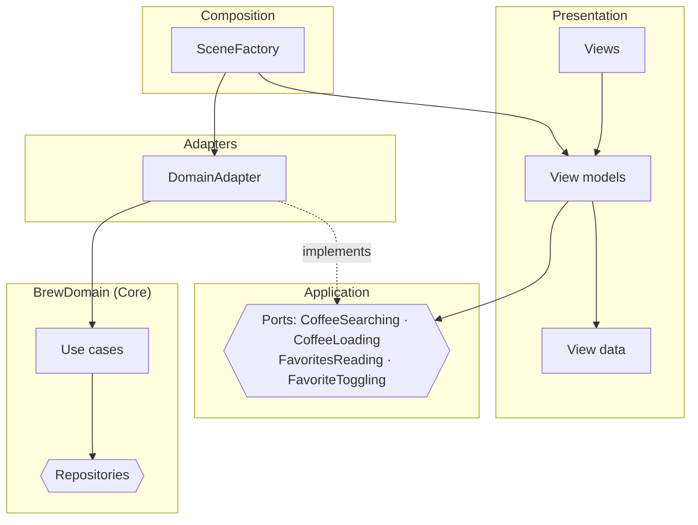

# Clean Architecture

> Dependencies point inward. Screens talk to the application through **ports** (protocols), and **adapters** connect those ports to the domain.

**UI:** SwiftUI · **Files:** [`Sources/`](Sources)



## How Brew is built

| Layer | Folder | Knows about |
|---|---|---|
| Presentation | [`Presentation/`](Sources/Presentation) | Ports and view data. Views never see `Coffee`: they get pre-formatted [`CoffeeRowViewData`](Sources/Presentation/Shared/CoffeeRowViewData.swift). |
| Application | [`Application/Ports/`](Sources/Application/Ports) | Domain entities only |
| Adapters | [`Adapters/`](Sources/Adapters) | Ports and the domain |
| Composition | [`Composition/`](Sources/Composition) | Everything. The only place that imports `BrewData`. |

Routes carry **IDs, not entities** (`.detail(coffeeID:)`), so each screen loads fresh data through its own port.

```swift
WindowGroup { BrewAppView() }
```

## Testing

One `StubPorts` type implements every port, so view model tests don't touch repositories at all. The adapter gets its own test against the real domain. See [`Tests/`](Tests).

## ✅ Choose it when

- The app is large, long-lived, and developed by several teams.
- Business rules must stay independent of frameworks, persistence and UI.

## ⚠️ Avoid it when

- The app is small: ports, adapters and view data triple the types for the same screens.
- Layers only forward calls. If every port method is a one-line pass-through, the layer isn't earning its place.
