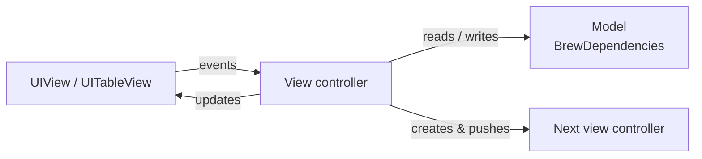

# MVC

> Apple's classic: the view controller loads the data, keeps the screen state, updates its views and creates the next screen.

**UI:** UIKit · **Files:** [`Sources/`](Sources)



## How Brew is built

| Screen | Type | What it does |
|---|---|---|
| Catalog | [`CatalogViewController`](Sources/CatalogViewController.swift) | Search controller, roast filter, pull to refresh, diffable data source, pushes the detail |
| Detail | [`CoffeeDetailViewController`](Sources/CoffeeDetailViewController.swift) | Shows the coffee and toggles the favorite |
| Favorites | [`FavoritesViewController`](Sources/FavoritesViewController.swift) | Lists favorites, reloads in `viewWillAppear` |
| App | [`BrewTabBarController`](Sources/BrewTabBarController.swift) | Two navigation controllers in a tab bar |

```swift
window.rootViewController = BrewTabBarController()
```

## Testing

All logic lives in view controllers, so tests need UIKit: they call `loadViewIfNeeded()`, drive the controller and inspect its views. They run on the iOS simulator only. See [`Tests/`](Tests).

## ✅ Choose it when

- The app is small, or a screen is simple and unlikely to grow.
- The team is new to iOS: it's the pattern Apple's documentation and samples use.

## ⚠️ Avoid it when

- Screens have real logic (filters, offline rules, several data sources). It all lands in the controller: the "Massive View Controller".
- You want fast unit tests. Anything tested here needs a view hierarchy and a simulator.
