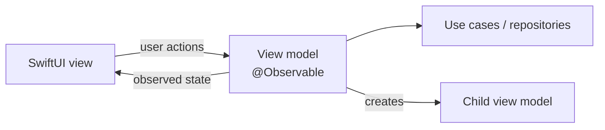

# MVVM

> Views render an `@Observable` view model. The view model holds screen state and talks to the domain.

**UI:** SwiftUI · **Files:** [`Sources/`](Sources)



## How Brew is built

| Screen | View model | View |
|---|---|---|
| Catalog | [`CatalogViewModel`](Sources/Catalog/CatalogViewModel.swift) | [`CatalogView`](Sources/Catalog/CatalogView.swift) |
| Detail | [`CoffeeDetailViewModel`](Sources/Detail/CoffeeDetailViewModel.swift) | [`CoffeeDetailView`](Sources/Detail/CoffeeDetailView.swift) |
| Favorites | [`FavoritesViewModel`](Sources/Favorites/FavoritesViewModel.swift) | [`FavoritesView`](Sources/Favorites/FavoritesView.swift) |

Navigation stays in the views: `NavigationLink(value:)` and `navigationDestination`. A parent view model creates the child view model (`makeDetailViewModel(for:)`).

```swift
WindowGroup { BrewAppView() }
```

## Testing

View models are plain `@MainActor` classes: create one with `BrewDependencies`, call `await load()`, assert on its properties. No UI needed. See [`Tests/`](Tests).

## ✅ Choose it when

- You use SwiftUI and want testable screen logic with the least ceremony.
- Navigation is simple (push a detail, a few sheets).

## ⚠️ Avoid it when

- Navigation gets conditional (login walls, deep links, flows across tabs). It ends up spread across views and view models: see [MVVM-C](../MVVMC) and [MVVM-R](../MVVMR).
- View models start creating many other view models; that's a sign a coordinator is missing.
