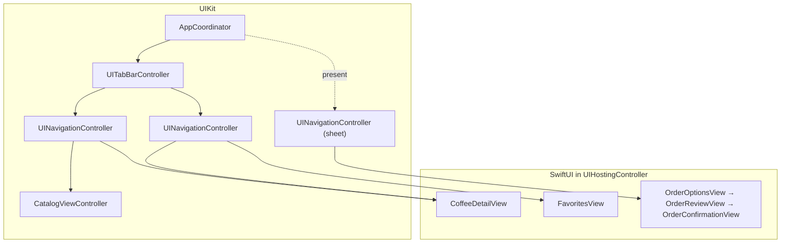

# MVVM-C Hybrid: UIKit to SwiftUI, one screen at a time

> Brew halfway through a migration. **UIKit coordinators** still own navigation; some screens are UIKit, the rest are SwiftUI inside `UIHostingController`. The app works at every step.

| Part | Framework | Code |
|---|---|---|
| Tab bar, navigation controllers, coordinators | UIKit | [`Sources/`](Sources) |
| Catalog | UIKit (the "legacy" screen) | [`MVVMCUIKit.CatalogViewController`](../UIKit/Sources/Screens/CatalogViewController.swift) |
| Coffee detail | SwiftUI (migrated) | [`MVVMCSwiftUI.CoffeeDetailView`](../SwiftUI/Sources/Screens/CoffeeDetailView.swift) |
| Favorites | SwiftUI (migrated) | [`MVVMCSwiftUI.FavoritesView`](../SwiftUI/Sources/Screens/FavoritesView.swift) |
| Order flow | SwiftUI (new feature) | [`MVVMCSwiftUI.OrderOptionsView`](../SwiftUI/Sources/Screens/OrderOptionsView.swift) and the next steps |
| View models | Neither | [`MVVMCViewModels`](../ViewModels/Sources) |

This target has no screens of its own. It imports the UIKit catalog from the [UIKit version](../UIKit) and the SwiftUI screens from the [SwiftUI version](../SwiftUI), and only its coordinators are new. The imports list exactly what's reused:

```swift
import class MVVMCUIKit.CatalogViewController
import protocol MVVMCUIKit.Coordinator
import struct MVVMCSwiftUI.CoffeeDetailView
```



## Migrating a screen is one line

Compare the hybrid [`CatalogCoordinator`](Sources/CatalogCoordinator.swift) with the [UIKit one](../UIKit/Sources/Coordinators/CatalogCoordinator.swift). The only difference is the line that builds the detail screen:

```diff
- navigationController.pushViewController(CoffeeDetailViewController(viewModel: detail), animated: true)
+ navigationController.pushViewController(UIHostingController(rootView: CoffeeDetailView(viewModel: detail)), animated: true)
```

The view model, its callbacks, the coordinator tree and the tests stay the same. That's the payoff of getting the architecture right **before** changing the UI framework.

## The migration, step by step

### 1. Move screen state into `@Observable` view models

This step makes the rest possible. A view controller that keeps its own state can't be replaced without rewriting its logic. A view controller that draws a view model can be swapped for a SwiftUI view that draws the same view model.

UIKit screens follow a view model with [`startObserving`](../UIKit/Sources/ObservationTracking.swift), a small wrapper around `withObservationTracking`:

```swift
override func viewDidLoad() {
    super.viewDidLoad()
    startObserving { [weak self] in self?.render() }
}
```

`render()` reads the view model; whenever a property it read changes, `render()` runs again. Newer UIKit can track observation by itself (opt-in on iOS 18, on by default on iOS 26), so on those versions `viewWillLayoutSubviews` or `updateProperties()` can replace the helper. Brew supports iOS 17, so it uses the helper.

### 2. Move navigation into coordinators, still in UIKit

Screens stop creating and pushing each other. They call the view model (`viewModel.select(coffee)`), the view model calls its closure, and a coordinator pushes. After this step no screen knows which screen comes next, so any of them can be rewritten on its own.

### 3. Build new features in SwiftUI

The order flow never existed in UIKit here. It was written in SwiftUI from the start, and the UIKit [`OrderCoordinator`](Sources/OrderCoordinator.swift) pushes each step in a `UIHostingController`. New code is where SwiftUI pays off first, and nothing old has to change.

### 4. Migrate existing screens, leaves first

Start with screens that don't lead anywhere else. Here that's the coffee detail, then the favorites list. Each one is a single line in a coordinator, as shown above, and can ship on its own.

### 5. Reuse UIKit views you aren't ready to rewrite

A custom control, a map, or a camera preview can stay UIKit inside a SwiftUI screen with `UIViewRepresentable`. Its `Coordinator` is SwiftUI's name for the object that receives UIKit callbacks; it has nothing to do with navigation coordinators:

```swift
struct RatingControl: UIViewRepresentable {
    @Binding var rating: Int

    func makeUIView(context: Context) -> StarRatingView {
        let view = StarRatingView()
        view.addTarget(context.coordinator, action: #selector(Coordinator.ratingChanged(_:)), for: .valueChanged)
        return view
    }

    func updateUIView(_ view: StarRatingView, context: Context) {
        view.rating = rating
        context.coordinator.rating = $rating
    }

    func makeCoordinator() -> Coordinator {
        Coordinator(rating: $rating)
    }

    final class Coordinator: NSObject {
        var rating: Binding<Int>

        init(rating: Binding<Int>) {
            self.rating = rating
        }

        @objc func ratingChanged(_ view: StarRatingView) {
            rating.wrappedValue = view.rating
        }
    }
}
```

### 6. Finally, replace the coordinators

When every screen is SwiftUI, swap the UIKit coordinators for the [SwiftUI ones](../SwiftUI/Sources/Coordinators). The view models don't change. Doing navigation last is deliberate: `NavigationStack` and `UINavigationController` don't mix well, and one navigation system for the whole app is easier to reason about than two.

## Pitfalls at the boundary

- **No `NavigationStack` inside a `UIHostingController` that's pushed onto a `UINavigationController`.** You get two navigation bars and two back stacks. Hosted screens rely on the UIKit navigation controller around them.
- **Titles and toolbars cross the boundary; not everything does.** `navigationTitle` and `toolbar` items show up in the UIKit navigation bar. For anything else, set it on the hosting controller's `navigationItem`, as [`OrderCoordinator`](Sources/OrderCoordinator.swift) does with `hidesBackButton`.
- **The SwiftUI environment starts empty in every `UIHostingController`.** Values set with `.environment` in one hosted screen don't reach the next one. Pass dependencies through view models, as Brew does, or inject them into every hosting controller.
- **Sizing.** A hosting controller embedded as a child view controller or inside a cell needs `sizingOptions = .intrinsicContentSize` to report SwiftUI's size to Auto Layout.
- **Retain cycles.** A closure stored in a SwiftUI view that captures the coordinator strongly keeps the whole flow alive. Capture `[weak self]`, as every coordinator here does.

## ⚠️ Don't use this as a destination

A hybrid app is a stage, not an architecture. Keep one framework in charge of navigation, move screens over in small steps, and set a point where the last UIKit screen goes. Two frameworks for years mean every developer has to know both, and every new screen raises the question "UIKit or SwiftUI?" again.

## Tests

[`Tests/`](Tests) check what's specific to the hybrid: the catalog is still `CatalogViewController`, the detail and favorites are `UIHostingController`s with the SwiftUI views inside, the order flow is SwiftUI driven by a UIKit child coordinator, and that child is released when the flow ends. They run on the iOS simulator.
