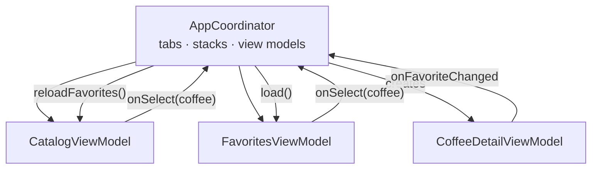

# MVVM-C

> MVVM plus a **Coordinator** that owns navigation and creates view models. View models only report what the user did.

**UI:** SwiftUI · **Files:** [`Sources/`](Sources)



## How Brew is built

- [`AppCoordinator`](Sources/Coordinator/AppCoordinator.swift) owns the selected tab, one navigation path per tab, and the view models. It wires their callbacks.
- View models expose closures (`onSelect`, `onFavoriteChanged`) and never import navigation.
- When a favorite changes in a detail screen, the coordinator refreshes the catalog and favorites **immediately**, even while they're off screen.
- Deep links (`brew://coffee/huila`) are one method: `open(_:)` switches tabs and sets the path.

```swift
WindowGroup { AppCoordinatorView() }
```

## Testing

The coordinator is plain Swift: select a coffee and assert on `catalogPath`, toggle a favorite and assert the other view models updated, open a URL and assert the tab and path. See [`Tests/`](Tests).

## ✅ Choose it when

- Navigation has rules: deep links, flows across tabs, "after X go to Y".
- Several screens must react to each other's changes.

## ⚠️ Avoid it when

- The app is a handful of pushes; the coordinator becomes boilerplate.
- One coordinator starts to know every screen of a large app. Split it per flow.
