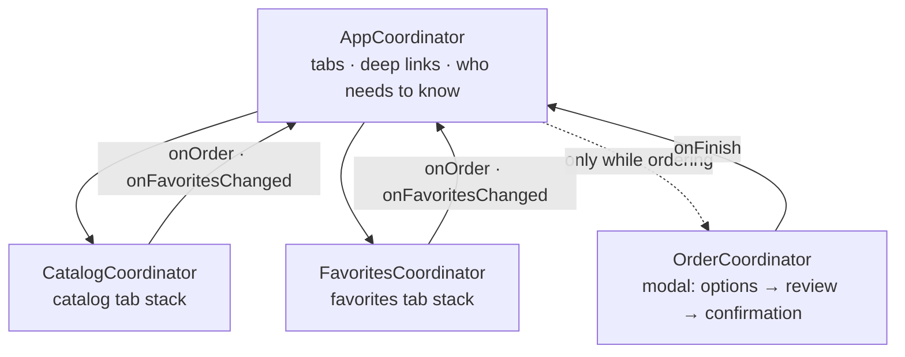

# MVVM-C

> MVVM plus a **tree of coordinators** that own navigation. View models report what the user did; coordinators decide where to go and which flows are alive.

Brew's MVVM-C is built three times on the **same view models**:

| Version | Coordinators | Screens | Root |
|---|---|---|---|
| [SwiftUI](SwiftUI/Sources) | `@Observable` state | SwiftUI | [`AppCoordinatorView`](SwiftUI/Sources/Coordinators/AppCoordinatorView.swift) |
| [UIKit](UIKit/Sources) | `Coordinator` protocol, `childCoordinators` | UIKit | [`BrewTabBarController`](UIKit/Sources/BrewTabBarController.swift) |
| [Hybrid](Hybrid) | UIKit | UIKit catalog, SwiftUI everything else | [`BrewTabBarController`](Hybrid/Sources/BrewTabBarController.swift) |

The [view models](ViewModels/Sources) are one target that all three import, so the versions differ only in coordinators and screens.

## The coordinator tree



| Coordinator | Owns | Tells its parent |
|---|---|---|
| `AppCoordinator` | The tabs, its children, the order flow while one is running, deep links | — |
| `CatalogCoordinator` | The catalog tab's stack and the detail screens pushed on it | `onOrder`, `onFavoritesChanged` |
| `FavoritesCoordinator` | The favorites tab's stack | `onOrder`, `onFavoritesChanged` |
| `OrderCoordinator` | Its own stack inside a sheet | `onFinish` |

The order flow is a **child coordinator**: it's created when the user taps *Order* in either tab, lives while the sheet is up, and is released when the flow ends. The same flow works from both tabs because neither tab knows how it works.

## The rules

1. **A parent owns its children.** It keeps them alive and removes them when their flow ends. A child that's never removed is a leak.
2. **Children only talk to their parent.** Favorites doesn't know Catalog exists. When a favorite changes in one tab, the tab reports up and `AppCoordinator` refreshes the other one.
3. **The parent presents and dismisses.** The child fills its own navigation stack; the parent decides how it appears and when it goes away.
4. **Every way out ends the flow:** *Cancel*, *Done*, and a swipe down.
5. **Deep links route down the tree.** `AppCoordinator` picks the tab and tells that child what to show; it never builds a tab's screens itself.
6. **View models don't navigate.** They expose closures (`onSelect`, `onOrder`, `onContinue`, `onPlaced`) and coordinators connect them.

## Same tree, two frameworks

| | SwiftUI | UIKit |
|---|---|---|
| A coordinator is | `@Observable` navigation state (`path: [Route]`) | An object that pushes onto a `UINavigationController` |
| A child stays alive while | It's in a parent property: `order: OrderCoordinator?` | It's in `childCoordinators` |
| Showing the child flow | `.sheet(item: $coordinator.order)` | `tabBarController.present(child.navigationController)` |
| Ending it | `order = nil` | `dismiss` + `removeChild(child)` |
| Swipe down | SwiftUI sets `order = nil` for you | `presentationControllerDidDismiss` → `finish()` |
| Screens follow view models | Automatically | [`startObserving { }`](UIKit/Sources/ObservationTracking.swift) around `withObservationTracking` |
| Coordinator tests run on | macOS, plain Swift | iOS simulator |

UIKit, the child flow from start to finish ([`AppCoordinator`](UIKit/Sources/Coordinators/AppCoordinator.swift)):

```swift
func startOrder(for coffee: Coffee) {
    guard order == nil else { return }
    let child = OrderCoordinator(coffee: coffee, dependencies: dependencies)
    child.onFinish = { [weak self, weak child] in
        guard let self, let child else { return }
        finishOrder(child, animated: true)
    }
    startChild(child)
    tabBarController.present(child.navigationController, animated: true)
}

private func finishOrder(_ child: OrderCoordinator, animated: Bool) {
    if tabBarController.presentedViewController === child.navigationController {
        tabBarController.dismiss(animated: animated)
    }
    removeChild(child)
}
```

SwiftUI, the same flow ([`AppCoordinator`](SwiftUI/Sources/Coordinators/AppCoordinator.swift) and [`AppCoordinatorView`](SwiftUI/Sources/Coordinators/AppCoordinatorView.swift)):

```swift
public func startOrder(for coffee: Coffee) {
    let child = OrderCoordinator(coffee: coffee, dependencies: dependencies)
    child.onFinish = { [weak self] in self?.order = nil }
    order = child
}

// In the view:
.sheet(item: $coordinator.order) { order in
    OrderCoordinatorView(coordinator: order)
}
```

## Deep links

| URL | Result |
|---|---|
| `brew://coffee/huila` | Catalog tab, Huila's detail on top |
| `brew://coffee/huila/order` | The same, then the order flow for Huila |

[`DeepLink`](ViewModels/Sources/DeepLink.swift) parses the URL once, and each version's `AppCoordinator.open(_:)` routes it down the tree.

## Testing

Coordinators are the part of MVVM-C that other architectures can't test, so every version tests them:

- Selecting a coffee pushes onto **that tab's** stack only.
- A favorite toggled in one tab reaches the other through the parent.
- *Order* from either tab starts the child flow, which walks options → review → confirmation.
- Finishing the flow, or swiping it down, removes the child **and releases it**:

```swift
weak var child: OrderCoordinator?
autoreleasepool {
    coordinator.startOrder(for: Coffee.samples[0])
    child = coordinator.order
    child?.finish()
}
#expect(child == nil)
```

- Deep links select the right tab, stack and flow.

The SwiftUI and view model tests run on macOS with `swift test`. The UIKit and hybrid tests need UIKit, so they run on the iOS simulator in CI.

## ✅ Choose it when

- Navigation has rules: deep links, flows that start from several places, "after X go to Y".
- Some flows have a lifecycle of their own: onboarding, checkout, sign-in.
- Several screens must react to each other's changes.

## ⚠️ Avoid it when

- The app is a handful of pushes. A coordinator per screen is boilerplate with no decisions in it.
- One coordinator starts to know every screen. That's what child coordinators are for: split by flow, not by screen.

## Pitfalls

- **Forgetting `removeChild`.** The flow still works, but every run leaks a coordinator and its screens. Test it with a `weak` reference, like the test above.
- **A child pushed onto its parent's stack.** The system back button pops it without telling any coordinator. Either present child flows modally, as Brew does, or have the parent watch `navigationController(_:didShow:animated:)` and finish the child whose first screen was popped.
- **Swipe to dismiss.** Without `UIAdaptivePresentationControllerDelegate` the sheet disappears and the child stays in `childCoordinators` forever.
- **Creating coordinators in SwiftUI `body`.** `body` runs many times. Keep children in the parent coordinator's state, not in the view.
- **Strong captures.** Every closure a parent hands to a child or a view model captures `[weak self]`, or the tree keeps itself alive.
