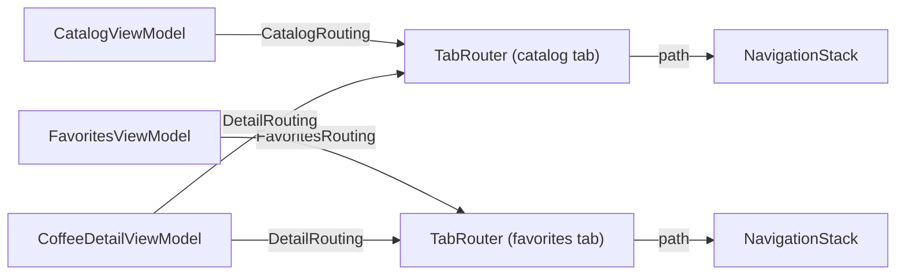

# MVVM-R

> MVVM plus a **Router** per navigation context. Each view model gets a small routing protocol and asks it to navigate.

**UI:** SwiftUI · **Files:** [`Sources/`](Sources)



## How Brew is built

- [`CatalogRouting`](Sources/Routing/CatalogRouting.swift), [`FavoritesRouting`](Sources/Routing/FavoritesRouting.swift) and [`DetailRouting`](Sources/Routing/DetailRouting.swift) are one-method protocols: each view model only sees the navigation it's allowed to do.
- [`TabRouter`](Sources/Routing/TabRouter.swift) implements all three and owns one tab's navigation path. [`RouteDestination`](Sources/Routing/RouteDestination.swift) builds the screen for a route.
- **Same screen, different behavior:** removing a favorite from the detail screen pops back in the Favorites tab (the coffee no longer belongs in that list) but stays put in the Catalog tab. The view model is identical; only its router differs.

```swift
WindowGroup { BrewAppView() }
```

## MVVM-C or MVVM-R?

| | MVVM-C | MVVM-R |
|---|---|---|
| Who creates view models | The coordinator | Views and `RouteDestination` |
| Navigation API seen by a view model | Closures | A small protocol |
| Cross-screen updates | The coordinator pushes them | Screens reload on appear |
| Best for | Flows and cross-tab rules | Many independent screens |

## Testing

View models are tested with a `SpyRouter`; `TabRouter` is tested on its own. See [`Tests/`](Tests).

## ⚠️ Avoid it when

- One router protocol per screen feels like ceremony for your app size; plain MVVM may be enough.
- Routers start holding business state. They should only know about navigation.
