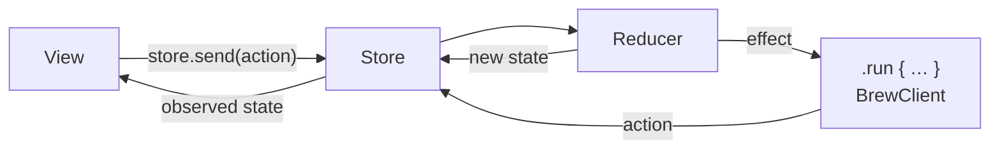

# TCA

> [The Composable Architecture](https://github.com/pointfreeco/swift-composable-architecture): state is a value, every change is an action, a reducer turns actions into new state and effects.

**UI:** SwiftUI · **Files:** [`Sources/`](Sources)



## How Brew is built

| Feature | Reducer | Holds |
|---|---|---|
| Catalog | [`CatalogFeature`](Sources/Catalog/CatalogFeature.swift) | Coffees, favorites, query, roast, loading and offline state |
| Detail | [`CoffeeDetailFeature`](Sources/Detail/CoffeeDetailFeature.swift) | One coffee and its favorite flag |
| Favorites | [`FavoritesFeature`](Sources/Favorites/FavoritesFeature.swift) | Favorite coffees |
| App | [`AppFeature`](Sources/App/AppFeature.swift) | Selected tab, one `StackState` per tab, the three features composed |

- **Navigation is state.** Tapping a coffee appends to `catalogPath`; the `NavigationStack` follows.
- **Cross-feature updates are explicit.** `AppFeature` listens for `.detail(.favoriteToggled)` and sends `.favoritesChanged` to the catalog and `.task` to favorites.
- **Dependencies:** [`BrewClient`](Sources/Dependencies/BrewClient.swift) is a `@DependencyClient` built from `BrewDependencies`. Tests override single endpoints.
- Search restarts cancel the previous one (`.cancellable(id:cancelInFlight:)`).

```swift
WindowGroup { AppView() }
```

## Testing

`TestStore` checks every state change and every received action. Exhaustive by default: a test fails if an action changes state you didn't assert. See [`Tests/`](Tests).

## ✅ Choose it when

- Many features share state and must stay consistent.
- You want exhaustive tests of state changes and effects.

## ⚠️ Avoid it when

- The team doesn't know TCA yet: the learning curve is the steepest here.
- You can't take a third-party dependency, or you need to stay on the latest Xcode on day one; TCA builds on macros and several Point-Free packages.
