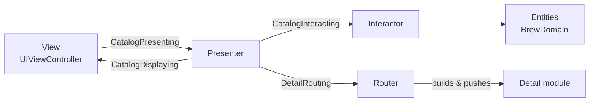

# VIPER

> **V**iew, **I**nteractor, **P**resenter, **E**ntity, **R**outer: every screen is split into five roles connected by protocols.

**UI:** UIKit · **Files:** [`Sources/`](Sources)



## How Brew is built

Each module has the same shape. For the catalog ([`Catalog/`](Sources/Catalog)):

| Role | Type | Responsibility |
|---|---|---|
| View | `CatalogViewController` | Draws `CatalogDisplayModel`, forwards every event |
| Presenter | `CatalogPresenter` | Screen state, formatting, decisions. **No UIKit.** |
| Interactor | `CatalogInteractor` | Business work through use cases |
| Router | `DetailRouter` | Builds and pushes the next module |
| Builder | `CatalogModule` | Creates the parts and connects them |

Ownership avoids retain cycles: view → presenter (strong), presenter → view (weak), presenter → router (strong), router → view controller (weak). The detail module has no router because nothing on it navigates.

```swift
window.rootViewController = BrewTabBarController()
```

## Testing

Presenters are plain Swift, so they're tested on macOS with a `SpyCatalogView` and a `SpyRouter`: send events, assert on what was displayed and where the router was asked to go. See [`Tests/`](Tests).

## ✅ Choose it when

- A large UIKit codebase with many developers needs strict, uniform boundaries.
- You want every piece of UIKit screen logic unit-tested without a simulator.

## ⚠️ Avoid it when

- The app is small or medium: 28 files here for what MVC does in 4.
- You use SwiftUI. Views already are a function of state; MVVM or TCA fit better.
