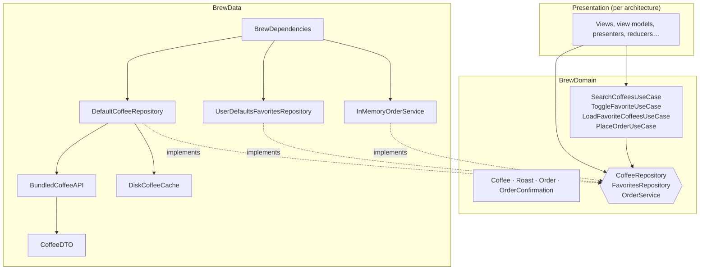

# Brew: the shared core

**Brew** is a small coffee catalog app. Its domain and data layers live here, with no UI, so the same app can be built with different architectures and UI frameworks on top of exactly the same core. Only the presentation layer changes.

## The app

| Screen | What it does |
|---|---|
| **Catalog** | Lists all coffees. Search by name, origin or tasting note. Filter by roast. Pull to refresh. Shows a heart on favorites. |
| **Detail** | Origin, roast, tasting notes, price and description. A button to add or remove the coffee from favorites. |
| **Favorites** | The coffees you marked, in catalog order. |
| **Order** | A flow started from the detail screen: choose bag size, grind and quantity, review the total, place the order, see the confirmation. Only the [MVVM-C versions](../Architectures/MVVMC) build it, because it's what shows child coordinators. |

### Rules every presentation layer must follow

1. The catalog loads from the cache when there is one, so it works **offline** after the first launch.
2. Pull to refresh always hits the network. If that fails, the current list **stays on screen** and an offline message is shown.
3. Search is **case- and diacritic-insensitive**: `cafe` finds `Café`, `tarrazu` finds `Tarrazú`.
4. Favorites **persist** across launches and update everywhere as soon as they change.
5. Prices are per 250 g bag. An order of 1 to 10 bags is valid; a failed order keeps the user on the review step with a message.

## Layers



**The dependency rule:** arrows only point inward. `BrewDomain` imports nothing but Foundation. `BrewData` depends on `BrewDomain`. Presentation depends on `BrewDomain` and gets its implementations from `BrewDependencies`.

### [`BrewDomain`](BrewDomain/Sources)

| Type | Role |
|---|---|
| `Coffee`, `Roast`, `Order`, `OrderConfirmation` | Entities. Plain `Sendable` values with no persistence or JSON concerns. `Order` computes its own total. |
| `CoffeeRepository`, `FavoritesRepository`, `OrderService` | What the domain needs from the outside world, as protocols. |
| `SearchCoffeesUseCase`, `ToggleFavoriteUseCase`, `LoadFavoriteCoffeesUseCase`, `PlaceOrderUseCase` | Application rules, callable like functions: `try await searchCoffees(query: "kenya")`. |
| `CoffeeError`, `OrderError` | Errors with user-facing messages. |

### [`BrewData`](BrewData/Sources)

| Type | Role |
|---|---|
| `CoffeeDTO` | The JSON shape (`snake_case`, prices as strings). Internal: it never leaves this module. |
| `BundledCoffeeAPI` | Serves [`coffees.json`](BrewData/Sources/Resources/coffees.json) with simulated latency and an offline switch. |
| `DefaultCoffeeRepository` | Cache first, network on refresh, cache kept when offline. |
| `DiskCoffeeCache`, `UserDefaultsFavoritesRepository` | Persistence, isolated in actors. |
| `InMemoryOrderService` | Places orders in memory with simulated latency and an offline switch. The live app uses it too, since Brew has no backend. |
| `InMemoryCoffeeRepository`, `InMemoryFavoritesRepository` | Ready-made fakes for previews and tests of any presentation layer. |
| `BrewDependencies` | The Composition Root: `.live()` for the app, `.preview()` for previews and tests. |

## Using it

```swift
import BrewData
import BrewDomain

let dependencies = BrewDependencies.live()

let coffees = try await dependencies.searchCoffees(query: "ethiopia", roast: .light)
await dependencies.toggleFavorite("yirgacheffe")
let favorites = try await dependencies.loadFavoriteCoffees()
let confirmation = try await dependencies.placeOrder(Order(coffee: favorites[0], size: .medium, quantity: 2))
```

## Tests

`swift test --filter BrewDomainTests` and `swift test --filter BrewDataTests`. The domain is tested with its own stubs, without `BrewData`; the data layer is tested against the real bundled catalog, a disk cache in a temporary file and an isolated `UserDefaults` suite.
