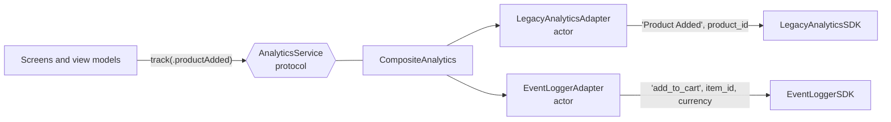

# Adapter

> Make a third-party API fit the interface your app owns, instead of letting it spread through your code.

## The problem

Analytics, crash reporting and payment SDKs have their own APIs. Calling them directly ties the whole app to one vendor:

```swift
// ❌ Vendor names, vendor keys and a vendor type in every screen
LegacyAnalyticsSDK.shared.track(eventName: "Product Added", properties: ["product_id": id, "price": price])
```

- **Switching vendors means touching every screen.** And marketing will ask you to add a second one.
- **Stringly-typed events:** `"Product Added"` in one screen, `"Product added"` in another.
- **Swift 6 friction:** most SDKs are non-`Sendable` classes with shared state and callback APIs.
- **Untestable:** you can't assert what was tracked without the real SDK.

## The solution

Define the interface the app wants (`AnalyticsService` with a typed `AnalyticsEvent`) and write one **adapter** per SDK that translates calls into that SDK's language.



## Code

**1. The app's interface.** See [`AnalyticsService.swift`](Sources/AnalyticsService.swift). Events are an enum, so a typo doesn't compile.

```swift
public enum AnalyticsEvent: Sendable, Equatable {
    case screenViewed(name: String)
    case productAdded(productID: Int, price: Decimal)
    case checkoutCompleted(orderID: String, total: Decimal)
}

public protocol AnalyticsService: Sendable {
    func track(_ event: AnalyticsEvent) async
    func identify(userID: String) async
    func flush() async throws
}
```

**2. An adapter per SDK.** See [`LegacyAnalyticsAdapter.swift`](Sources/LegacyAnalyticsAdapter.swift). Three translations happen here:

| | App side | SDK side |
|---|---|---|
| Names | `.checkoutCompleted` | `"Order Completed"` |
| Data | `orderID`, `total: Decimal` | `["order_id": …, "revenue": …]` |
| Concurrency | `async throws` | completion handler |

```swift
public actor LegacyAnalyticsAdapter: AnalyticsService {
    private let sdk = LegacyAnalyticsSDK()

    public func flush() async throws {
        try await withCheckedThrowingContinuation { continuation in
            sdk.flush { error in
                if let error { continuation.resume(throwing: error) } else { continuation.resume() }
            }
        }
    }
}
```

**The adapter is an actor.** The SDK is a non-`Sendable` class. Owned privately by an actor, it's only touched from one place at a time, and the rest of the app sees a `Sendable` service. No `@unchecked Sendable` or `nonisolated(unsafe)` is needed.

**3. A second vendor, same app code.** [`EventLoggerAdapter.swift`](Sources/EventLoggerAdapter.swift) maps the same events to snake_case names and different keys (`add_to_cart`, `item_id`, `currency`). `CompositeAnalytics` sends every event to both.

## Run it

- **Preview:** open [`AnalyticsPlayground.swift`](Sources/AnalyticsPlayground.swift). Tap an event and see what each SDK received, side by side.
- **Tests:** `swift test --filter AdapterTests`. They check each adapter's mapping, the callback-to-async bridge and the composite. See [`AdapterTests.swift`](Tests/AdapterTests.swift).

## ⚠️ When NOT to use it

- **SDKs that are the product.** If your app is built around one SDK (a maps app on MapKit, a video app on AVFoundation), wrapping its whole surface just adds a worse copy of it.
- **Adapters that mirror the vendor API one-to-one:**

  ```swift
  // ❌ Same shape as the SDK, so switching vendors still means changing every call site
  protocol AnalyticsService {
      func track(eventName: String, properties: [String: Any]?)
  }
  ```

  The interface should speak your app's language (`AnalyticsEvent`), not the vendor's.
- **Leaking vendor types.** An adapter that returns `MixpanelPeople` or takes `FIRAnalyticsParameter` has failed at its one job.

## Trade-offs

| 👍 Gains | 👎 Costs |
|---|---|
| Swap or add vendors in one file | One more layer between you and the SDK |
| Typed events instead of strings | Vendor features you don't expose aren't reachable |
| Non-`Sendable` SDKs contained in an actor | Mapping code to maintain |
| Tests without the real SDK | |
