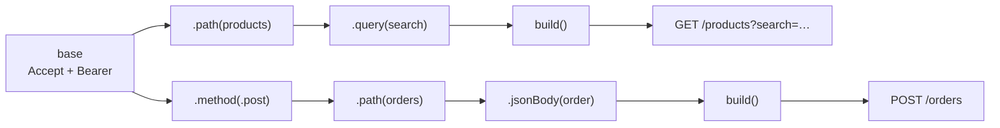

# Builder

> Build a complex object step by step, with readable calls and validation at the end.

The example builds `URLRequest`s, something almost every iOS app does.

## The problem

Building a request by hand repeats the same boilerplate everywhere and makes small mistakes easy:

```swift
// ❌ Ten lines per request, copied into every endpoint
var components = URLComponents(string: "https://api.example.com/v1/products")!
var items: [URLQueryItem] = []
if let search { items.append(URLQueryItem(name: "search", value: search)) }
if let category { items.append(URLQueryItem(name: "category", value: category)) }
components.queryItems = items.isEmpty ? nil : items
var request = URLRequest(url: components.url!)
request.httpMethod = "GET"
request.setValue("application/json", forHTTPHeaderField: "Accept")
request.setValue("Bearer \(token)", forHTTPHeaderField: "Authorization")
```

- **Repetition:** auth headers and base URLs copied into every endpoint.
- **Easy mistakes:** a forgotten `Content-Type`, `"POTS"` instead of `"POST"`, a body on a `GET`.
- **Force unwraps** on URLs built from user input.

## The solution

A `RequestBuilder` where each step returns a new builder, and `build()` validates everything at the end.



## Code

**1. The builder.** See [`RequestBuilder.swift`](Sources/RequestBuilder.swift).

```swift
public struct RequestBuilder: Sendable {
    public func method(_ method: HTTPMethod) -> Self
    public func path(_ path: String) -> Self
    public func query(_ name: String, _ value: String?) -> Self   // nil is skipped
    public func header(_ name: String, _ value: String) -> Self
    public func bearerToken(_ token: String) -> Self
    public func jsonBody(_ value: some Encodable) throws(RequestBuilderError) -> Self
    public func build() throws(RequestBuilderError) -> URLRequest
}
```

**It's a value type, not a class.** Classic builders mutate `self` and return it, so a shared builder can be changed by anyone holding it. Here each step returns a modified **copy**:

- A configured base builder can be stored and reused. No request can leak its path or method into another one.
- The builder is `Sendable` for free, so it's safe to share across tasks under Swift 6.

**2. Typed throws.** `build()` declares `throws(RequestBuilderError)`, so callers know exactly which errors can happen: `.invalidURL`, `.bodyNotAllowed(.get)` or `.encodingFailed`.

**3. Endpoints built from one base.** See [`ShopAPI.swift`](Sources/ShopAPI.swift).

```swift
base = RequestBuilder(baseURL: baseURL)
    .header("Accept", "application/json")
    .bearerToken(token)

func products(search: String? = nil, category: String? = nil) throws(RequestBuilderError) -> URLRequest {
    try base.path("products").query("search", search).query("category", category).build()
}
```

**4. Debug output.** `request.curlCommand` prints any request as a `curl` command you can paste into a terminal.

## Run it

- **Preview:** open [`BuilderPlayground.swift`](Sources/BuilderPlayground.swift). Type a search term and watch the generated `curl` command update.
- **Tests:** `swift test --filter BuilderTests`. They cover defaults, query items, headers, JSON bodies, validation and base-builder reuse. See [`Tests/`](Tests).

## ⚠️ When NOT to use it

- **Simple objects.** If an initializer with default arguments is readable, use it. Swift's default and labeled arguments already cover most of what builders do in Java.

  ```swift
  // ❌ A builder for three fields
  let user = UserBuilder().name("Ada").email("ada@example.com").age(36).build()

  // ✅ Swift already does this
  let user = User(name: "Ada", email: "ada@example.com", age: 36)
  ```

- **Class-based builders shared across threads.** A mutable builder class stored in a property is a data race waiting to happen. Prefer a struct.
- **When the result is a view.** SwiftUI's modifiers are already a builder. Wrapping them in another builder adds nothing.

## Trade-offs

| 👍 Gains | 👎 Costs |
|---|---|
| Readable, chainable construction | More code than a plain initializer |
| Validation in one place (`build()`) | Errors surface at `build()`, not at compile time |
| Reusable, shareable base configuration | Every new option needs a builder method |
| Value semantics: safe to share | |
