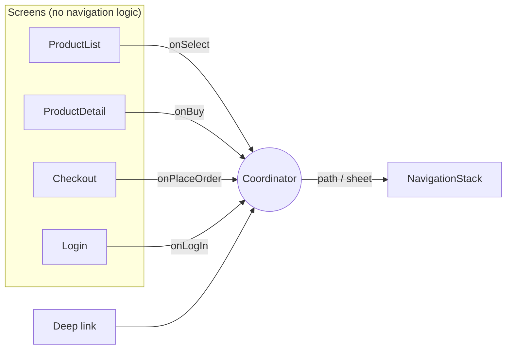
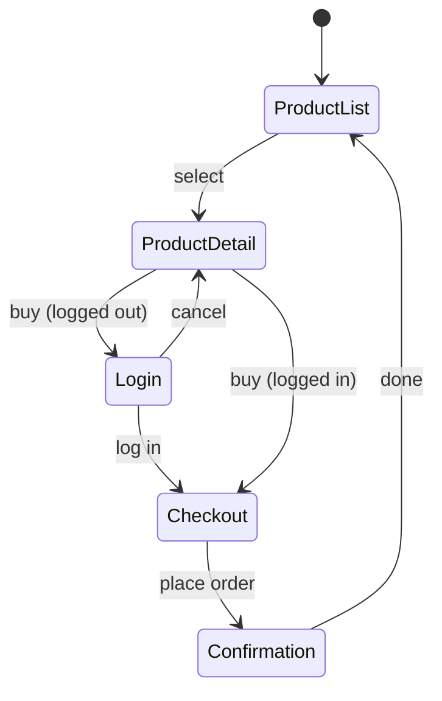

# Coordinator

> Take navigation decisions out of your screens and put them in one object that owns the flow.

This pattern comes in two versions: **SwiftUI** (`NavigationStack` + `@Observable`) and **UIKit** (`UINavigationController`).

## The problem

When screens decide where to go next, the flow is spread across every screen:

```swift
// ❌ The detail screen knows about login, checkout and the session
struct ProductDetailView: View {
    @Environment(Session.self) var session
    @State private var showLogin = false
    @State private var goToCheckout = false

    var body: some View {
        Button("Buy") {
            if session.isLoggedIn { goToCheckout = true } else { showLogin = true }
        }
        .sheet(isPresented: $showLogin) { LoginView() }
        .navigationDestination(isPresented: $goToCheckout) { CheckoutView(product: product) }
    }
}
```

- **Screens can't be reused:** the detail screen always goes to checkout, even in a flow that doesn't need it.
- **Deep links are painful:** to open `modernios://product/3` you have to fake taps through several screens.
- **The flow isn't testable:** "log in, then continue to checkout" only exists inside view code.

## The solution

Screens report **what happened** through closures. A coordinator decides **what comes next**.



The checkout flow, decided in one place:



## Code: SwiftUI

**1. The coordinator is plain Swift.** See [`ShopCoordinator.swift`](Sources/SwiftUI/ShopCoordinator.swift). No SwiftUI import, so every decision is unit-testable.

```swift
@MainActor @Observable
public final class ShopCoordinator {
    public var path: [Route] = []
    public var sheet: Sheet?

    public func startCheckout(for product: Product) {
        guard isLoggedIn else {
            pendingRoute = .checkout(product)
            sheet = .login
            return
        }
        path.append(.checkout(product))
    }
}
```

**2. One view connects it to SwiftUI.** See [`ShopCoordinatorView.swift`](Sources/SwiftUI/ShopCoordinatorView.swift).

```swift
NavigationStack(path: $coordinator.path) {
    ProductListView(products: coordinator.products) { product in
        coordinator.showProduct(product)
    }
    .navigationDestination(for: ShopCoordinator.Route.self) { route in
        destination(for: route)
    }
}
.sheet(item: $coordinator.sheet) { ... }
.onOpenURL { url in _ = coordinator.handle(url) }
```

**3. Deep links rebuild the stack in one line:** `path = [.product(product)]`.

## Code: UIKit

See [`UIKitShopCoordinator.swift`](Sources/UIKit/UIKitShopCoordinator.swift). The classic coordinator: it creates view controllers, sets their callbacks, and pushes or presents them.

```swift
private func showProduct(_ product: Product) {
    let detail = ActionViewController(title: product.name, message: product.formattedPrice, buttonTitle: "Buy")
    detail.onAction = { [weak self] in
        self?.startCheckout(for: product)
    }
    navigationController?.pushViewController(detail, animated: true)
}
```

**Who keeps the coordinator alive?** A common UIKit bug is a coordinator that gets deallocated right after `start()`, because every callback holds it `weak`. Here, the navigation controller owns the coordinator and the coordinator holds the navigation controller `weak`, so there is no retain cycle:

```swift
// SceneDelegate
window.rootViewController = UIKitShopCoordinator.makeRootViewController()
```

## SwiftUI vs UIKit

| | SwiftUI | UIKit |
|---|---|---|
| Navigation state | Data: `path: [Route]` | Imperative: `push`, `present` |
| Deep links | Replace `path` | Rebuild the view controller stack |
| Testing | Assert on `path` and `sheet` | Needs a navigation controller or a mock |
| Memory | Owned by `@State` | Must be retained explicitly |

## Run it

- **Previews:** [`ShopCoordinatorView.swift`](Sources/SwiftUI/ShopCoordinatorView.swift) has logged-out and logged-in previews. [`UIKitShopCoordinator.swift`](Sources/UIKit/UIKitShopCoordinator.swift) has a UIKit preview (pick an iOS simulator as the preview destination).
- **Tests:** `swift test --filter CoordinatorTests`. They cover the login detour, cancel, pop to root and deep links without rendering a single view. See [`ShopCoordinatorTests.swift`](Tests/ShopCoordinatorTests.swift).

## ⚠️ When NOT to use it

- **Simple apps with shallow navigation.** A few `NavigationLink`s in a tab or two don't need a coordinator. Add one when the flow has conditions (login walls, onboarding, paywalls) or when you need deep links.
- **A god coordinator for the whole app.** One coordinator that knows every screen becomes the new massive view controller. Split by flow: `ShopCoordinator`, `OnboardingCoordinator`, `SettingsCoordinator`.
- **Passing the coordinator into every screen:**

  ```swift
  // ❌ The screen is tied to one coordinator type and can call any navigation method
  struct ProductDetailView: View {
      let coordinator: ShopCoordinator
      var body: some View {
          Button("Buy") { coordinator.startCheckout(for: product) }
      }
  }
  ```

  Pass closures (`onBuy`) instead. The screen then works in any flow, and previews don't need a coordinator.

## Trade-offs

| 👍 Gains | 👎 Costs |
|---|---|
| Reusable screens | More indirection: closures instead of direct links |
| Flow logic is unit-testable | A route enum that grows with every screen |
| Deep links are a one-liner | In UIKit, memory ownership needs care |
| One place to read the whole flow | Overkill for flat, simple navigation |
