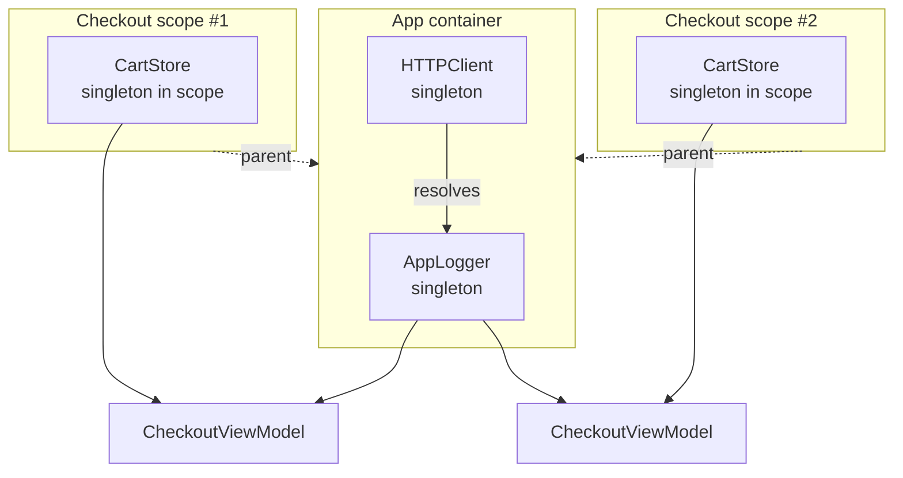

# DI Container

> A registry that builds your dependencies and manages how long they live.

Read [Dependency Injection](../DependencyInjection) first. A container doesn't replace constructor injection. It automates the wiring behind it.

## The problem

Manual wiring works well until the app grows. Then the Composition Root turns into this:

```swift
// ❌ Every new dependency means editing a long chain by hand
let logger = ConsoleLogger()
let http = URLSessionHTTPClient(logger: logger)
let tokenStore = KeychainTokenStore()
let auth = AuthService(http: http, tokenStore: tokenStore, logger: logger)
let userService = RemoteUserService(http: http, auth: auth)
let cart = CartStore() // Shared by every checkout? Or new each time? Who resets it?
// ...80 more lines
```

- **Order matters:** you must build every dependency before the things that use it.
- **Lifetimes are implicit:** nothing says which objects are app-wide and which belong to one flow.
- **Thread safety:** under Swift 6, a lazily-built shared object needs a lock or an actor.

## The solution

Register a factory and a **scope** for each type once. The container builds objects on demand, resolves their dependencies and caches singletons.



## Code

**1. The container.** See [`Container.swift`](Sources/Container.swift). About 100 lines, with no `@unchecked Sendable`: all state sits behind an `OSAllocatedUnfairLock`.

```swift
public final class Container: Sendable {
    public func register<T: Sendable>(
        _ type: T.Type = T.self,
        scope: Scope = .transient,
        factory: @escaping @Sendable (Container) throws -> T
    )

    public func resolve<T: Sendable>(_ type: T.Type = T.self) throws -> T

    public func makeChild() -> Container
}
```

**2. Registrations in one place.** See [`Container+CompositionRoot.swift`](Sources/Container+CompositionRoot.swift).

```swift
container.register((any AppLogger).self, scope: .singleton) { _ in
    ConsoleLogger()
}
container.register((any HTTPClient).self, scope: .singleton) { container in
    try URLSessionHTTPClient(logger: container.resolve())
}
```

**3. Feature scopes with child containers.** Each checkout flow gets a fresh `CartStore`, while app-wide singletons are shared:

```swift
public func makeCheckoutScope() -> Container {
    let scope = makeChild()
    scope.register(CartStore.self, scope: .singleton) { _ in CartStore() }
    return scope
}
```

**4. Constructor injection at the edges.** The view model still takes plain dependencies. Only the factory method sees the container:

```swift
@MainActor
public func makeCheckoutViewModel() throws -> CheckoutViewModel {
    try CheckoutViewModel(cart: resolve(), logger: resolve())
}
```

### Scopes

| `Container.Scope` | Lifetime | Example |
|---|---|---|
| `.transient` | New instance on every `resolve` | Formatters, request builders |
| `.singleton` | One per container | Logger, HTTP client, database |
| `.singleton` in a child | One per feature, freed with the child | Cart in a checkout flow, form state in a wizard |

## Run it

- **Previews:** [`CheckoutFlow.swift`](Sources/CheckoutFlow.swift) builds the screen from the container, including a missing registration. [`CheckoutView.swift`](Sources/CheckoutView.swift) builds it without any container.
- **Tests:** `swift test --filter DIContainerTests`. They cover scopes, child containers, test overrides and 100 concurrent resolves sharing one singleton. See [`Tests/`](Tests).

## ⚠️ When NOT to use it

- **Small apps.** With a dozen dependencies, a manual Composition Root is shorter, compile-time checked and easier to read. Reach for a container when wiring by hand actually hurts.
- **Injecting the container itself.** This is the Service Locator anti-pattern:

  ```swift
  // ❌ Any type can now pull anything, and missing registrations crash at runtime deep in the app
  final class CheckoutViewModel {
      init(container: Container) {
          self.cart = try! container.resolve()
          self.analytics = try! container.resolve()
      }
  }
  ```

  Keep `resolve` in the Composition Root and factory methods. Everything else takes plain constructor parameters.
- **When you want compile-time guarantees.** A type-keyed container moves "is this registered?" from compile time to runtime. If that trade isn't worth it, stay with manual DI.

## Trade-offs

| 👍 Gains | 👎 Costs |
|---|---|
| Dependencies built in the right order automatically | Missing registrations fail at runtime, not compile time |
| Lifetimes are explicit (`scope:`) | Circular dependencies overflow the stack instead of failing to compile |
| Easy test overrides: register the type again | One more concept for the team to learn |
| Thread-safe lazy singletons | Easy to slide into the Service Locator anti-pattern |

## Libraries

Writing your own container is a good way to understand one. In production you might pick a library instead:

| | This repo | [swift-dependencies](https://github.com/pointfreeco/swift-dependencies) | [Factory](https://github.com/hmlongco/Factory) | [Swinject](https://github.com/Swinject/Swinject) |
|---|---|---|---|---|
| Lookup | By type | By key path | By computed property | By type (+ name) |
| Missing dependency | Throws at runtime | Compile error | Compile error | `nil` at runtime |
| Test overrides | Register again | `withDependencies { }` | `register { }` | Register again |
| Style | Explicit `resolve` | `@Dependency` property wrapper | `@Injected` property wrapper | Explicit `resolve` |
