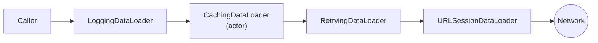

# Decorator

> Add behavior to an object by wrapping it in another object with the same interface.

The example adds **logging, caching and retries** to a data loader without changing the loader.

## The problem

Cross-cutting behavior tends to pile up inside the class that does the real work:

```swift
// ❌ One class that loads, caches, retries and logs. Every feature needs editing it.
final class ImageLoader {
    private var cache: [URL: Data] = [:]

    func data(from url: URL) async throws -> Data {
        if let cached = cache[url] { return cached }
        print("GET \(url)")
        for attempt in 1...3 {
            do {
                let data = try await URLSession.shared.data(from: url).0
                cache[url] = data
                return data
            } catch where attempt < 3 { continue }
        }
        fatalError()
    }
}
```

- **Can't turn features on or off:** a screen that must not cache still gets the cache.
- **Can't test one thing:** testing retries also exercises caching and the network.
- **Data race:** `cache` is shared mutable state in a class, which doesn't compile under Swift 6.

## The solution

Each behavior becomes its own `DataLoader` that wraps another `DataLoader`. Stack only the ones you need.



## Code

**1. One small interface.** See [`DataLoader.swift`](Sources/DataLoader.swift).

```swift
public protocol DataLoader: Sendable {
    func data(from url: URL) async throws -> Data
}
```

**2. Decorators that wrap it.** See [`Decorators/`](Sources/Decorators).

| Decorator | Adds | Swift 6 detail |
|---|---|---|
| [`LoggingDataLoader`](Sources/Decorators/LoggingDataLoader.swift) | Request, size and duration logs | Log sink is a `@Sendable` closure |
| [`RetryingDataLoader`](Sources/Decorators/RetryingDataLoader.swift) | Retries with a delay | Never retries `CancellationError` |
| [`CachingDataLoader`](Sources/Decorators/CachingDataLoader.swift) | In-memory cache and request merging | An `actor`, so the cache is race-free |

The caching decorator also merges **concurrent** requests for the same URL: if two views ask for the same avatar at once, only one network call is made.

```swift
if let running = inFlight[url] {
    return try await running.value
}
```

**3. Fluent composition.** See [`DataLoader+Decorators.swift`](Sources/DataLoader+Decorators.swift).

```swift
let loader = URLSessionDataLoader()
    .retrying(attempts: 3)
    .caching()
    .logging { print($0) }
```

**Order matters.** Read the chain from the network outwards:

- `.retrying().caching()`: a cached response skips retries entirely; a failed request is retried before anything is cached.
- `.caching().retrying()`: retries wrap the cache, which is rarely what you want.
- `.logging()` last logs every call, including cache hits. Put it before `.caching()` to log only real network calls.

## Run it

- **Preview:** open [`DecoratorPlayground.swift`](Sources/DecoratorPlayground.swift). The fake network fails once, then succeeds. Turn retry and caching on and off, tap **Load avatar** a few times and compare the log and the network call count.
- **Tests:** `swift test --filter DecoratorTests`. Each decorator is tested alone against a stub, plus one test for the full stack. See [`Tests/`](Tests).

## ⚠️ When NOT to use it

- **Behavior that belongs to the object.** Parsing a response or validating a status code is the loader's job, not a decorator's.
- **Very deep stacks.** Ten wrappers make stack traces and debugging painful. If you always use the same stack, build it once in a factory method.
- **Decorators that depend on their position:**

  ```swift
  // ❌ Only works if a CachingDataLoader happens to be somewhere below it
  struct CacheStatsLoader: DataLoader {
      let base: CachingDataLoader  // tied to one concrete decorator
  }
  ```

  A decorator should accept `any DataLoader` and work anywhere in the chain.

## Trade-offs

| 👍 Gains | 👎 Costs |
|---|---|
| Add or remove behavior per call site | More small types |
| Each behavior tested alone | Order of wrapping is easy to get wrong |
| The wrapped type never changes | Harder to debug through many layers |
| Works with any implementation of the protocol | Only what the protocol exposes can be decorated |
