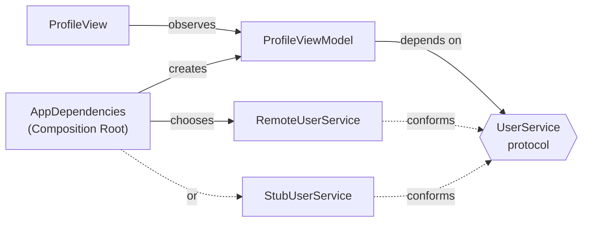

# Dependency Injection

> Give an object what it needs instead of letting it go and get it.

## The problem

A view model that reaches for a global singleton is tied to the real network forever:

```swift
// ❌ Hidden dependency
@MainActor @Observable
final class ProfileViewModel {
    var user: User?

    func load() async {
        user = try? await APIClient.shared.fetchUser(id: 1)
    }
}
```

- **Untestable:** every test hits the real API.
- **No previews:** SwiftUI previews need a network connection and a working server.
- **Hidden coupling:** nothing in the initializer tells you this type talks to the network.
- **Swift 6 friction:** `static let shared` on a non-`Sendable` class is a compile error under strict concurrency.

## The solution

Depend on a protocol, receive it through the initializer, and choose the concrete type in **one** place: the Composition Root.



## Code

**1. An abstraction that is `Sendable`.** See [`UserService.swift`](Sources/UserService.swift).

```swift
public protocol UserService: Sendable {
    func fetchUser(id: Int) async throws -> User
}
```

**2. Constructor injection.** See [`ProfileViewModel.swift`](Sources/ProfileViewModel.swift).

```swift
@MainActor @Observable
public final class ProfileViewModel {
    private let userService: any UserService

    public init(userService: any UserService) {
        self.userService = userService
    }
}
```

**3. A Composition Root.** See [`AppDependencies.swift`](Sources/AppDependencies.swift).

```swift
public struct AppDependencies: Sendable {
    public let userService: any UserService

    public static let live = AppDependencies(userService: RemoteUserService())

    @MainActor
    public func makeProfileViewModel() -> ProfileViewModel {
        ProfileViewModel(userService: userService)
    }
}
```

**4. Environment injection in SwiftUI.** See [`ProfileView.swift`](Sources/ProfileView.swift).

```swift
@main
struct MyApp: App {
    var body: some Scene {
        WindowGroup {
            ProfileScreen(userID: 1)
                .environment(\.dependencies, .live)
        }
    }
}
```

`ProfileScreen` reads `@Environment(\.dependencies)` and builds its view model. Deep view trees get the container without passing it through every initializer.

## Run it

- **Previews:** open `Package.swift` in Xcode, then open [`ProfileView.swift`](Sources/ProfileView.swift). The canvas shows the same view with three dependencies: stub success, stub failure and the live network.
- **Tests:** `swift test --filter DependencyInjectionTests`. The tests use a stub and an actor-based spy, so they never touch the network. See [`ProfileViewModelTests.swift`](Tests/ProfileViewModelTests.swift).

## ⚠️ When NOT to use it

- **Pure functions and value types.** `DateFormatter` settings, math helpers and model structs don't need a protocol. Inject things with side effects: network, disk, clock, analytics.
- **A protocol with only one implementation, ever.** If you never swap it in tests or previews, the protocol is just noise. Add it when you need the second implementation.
- **Passing the whole container everywhere.** This is the Service Locator anti-pattern. Dependencies are hidden again, just in a different place:

  ```swift
  // ❌ The view model can now reach anything, and its initializer tells you nothing
  init(dependencies: AppDependencies) {
      self.userService = dependencies.userService
  }
  ```

  Inject what the type actually uses. Only the Composition Root and factory methods should see the container.

## Trade-offs

| 👍 Gains | 👎 Costs |
|---|---|
| Fast, deterministic tests | One protocol per dependency |
| Previews without a network | Wiring code in the Composition Root |
| Dependencies visible in the initializer | Long initializers when a type needs many dependencies (often a sign it does too much) |
| Swapping implementations in one place | |
