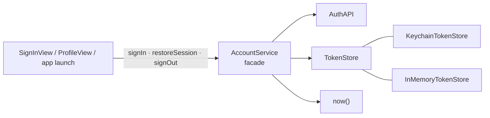
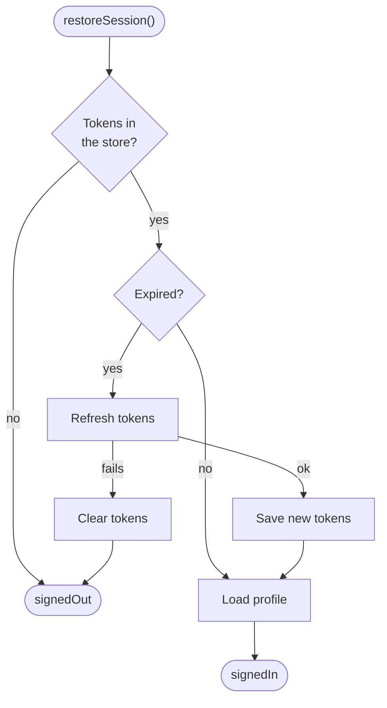

# Facade

> One simple API in front of several subsystems that have to be used together in the right order.

The example is **authentication**: an auth API, token storage in the Keychain, token refresh and profile loading, behind three methods.

## The problem

Signing in touches several systems, and every screen that does it has to get the order right:

```swift
// ❌ The sign-in screen knows the API, the Keychain, expiry rules and the profile endpoint
func signInTapped() async {
    do {
        let tokens = try await authAPI.signIn(email: email, password: password)
        try keychain.save(tokens)
        let profile = try await authAPI.profile(accessToken: tokens.accessToken)
        appState.user = profile
    } catch {
        try? keychain.clear()   // easy to forget, and then the app starts "half signed in"
        errorText = error.localizedDescription
    }
}
```

- **Duplicated sequences:** sign-in, launch and "session expired" flows each repeat parts of this.
- **Forgotten steps:** clearing tokens on failure, refreshing expired tokens, revoking on sign-out.
- **Screens depend on infrastructure:** the Keychain API leaks into view code.

## The solution

An `AccountService` facade exposes what the app actually needs and hides how it's done.



What `restoreSession()` does on launch, so no screen has to:



## Code

**1. The facade.** See [`AccountService.swift`](Sources/AccountService.swift).

```swift
@MainActor @Observable
public final class AccountService {
    public private(set) var state: State   // .signedOut, .loading, .signedIn(UserProfile)

    public func signIn(email: String, password: String) async
    public func restoreSession() async
    public func signOut() async
}
```

Screens call three methods and observe one `state`. They never see tokens.

**2. The subsystems.** See [`Subsystems/`](Sources/Subsystems). Each is small and testable on its own, and the facade depends only on their protocols:

| Subsystem | Protocol | Implementations |
|---|---|---|
| Backend | `AuthAPI` | `StubAuthAPI` (a real app adds a URLSession-based one) |
| Token storage | `TokenStore` | [`KeychainTokenStore`](Sources/Subsystems/KeychainTokenStore.swift), `InMemoryTokenStore` |
| Time | `@Sendable () -> Date` | `Date()` in the app, a test clock in tests |

**3. The Keychain stays inside one type.** `SecItemAdd`, `SecItemCopyMatching` and `CFDictionary` casts live only in `KeychainTokenStore`. Tokens are stored with `kSecAttrAccessibleAfterFirstUnlockThisDeviceOnly`, so they aren't copied to backups or other devices.

## Run it

- **Preview:** open [`FacadePlayground.swift`](Sources/FacadePlayground.swift). Sign in with `password` (try a wrong one too), then sign out.
- **Tests:** `swift test --filter FacadeTests`. They cover sign-in, wrong passwords, restoring with valid and expired tokens, a failed refresh and sign-out, with a controllable clock. See [`Tests/`](Tests).

## ⚠️ When NOT to use it

- **A single subsystem.** A "facade" over one class that forwards every call is just an extra layer.
- **A facade that re-exports its subsystems:**

  ```swift
  // ❌ Callers can go around the facade, so the rules it enforces are optional
  final class AccountService {
      let api: AuthAPI
      let tokenStore: TokenStore
  }
  ```

  Keep subsystems private. If a screen needs something the facade doesn't offer, add a method with a name from the app's point of view.
- **A god object.** A facade for "everything about the user" grows into accounts, settings, subscriptions and notifications. Keep one facade per area.

## Trade-offs

| 👍 Gains | 👎 Costs |
|---|---|
| Screens use three methods instead of four systems | One more type between screens and subsystems |
| Ordering rules (save, clear, refresh) in one place | Advanced subsystem features need new facade methods |
| Subsystems can be swapped (Keychain ↔ memory) | Can grow into a god object if not kept focused |
| The whole flow is testable without UI | |
