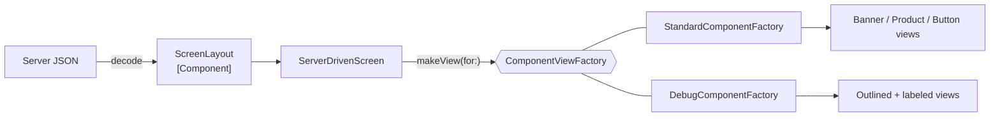

# Factory

> Let one object decide which concrete type to create, so the code that uses it doesn't have to.

The example is **server-driven UI**: the server sends a list of components as JSON, and a factory turns each one into a SwiftUI view.

## The problem

Without a factory, the code that decides *which* view to build is mixed into the screen, often copied across several screens:

```swift
// ❌ The screen knows every component type, how to parse it and how to draw it
ForEach(json["components"] as! [[String: Any]], id: \.self) { item in
    if item["type"] as? String == "banner" {
        BannerView(title: item["title"] as! String)
    } else if item["type"] as? String == "product" {
        ProductRowView(name: item["name"] as! String, price: item["price"] as! Double)
    }
}
```

- **Crashes on bad data:** one missing field and `as!` takes down the app.
- **Old app versions break** when the server adds a new component type.
- **One look only:** rendering the same data differently (a debug view, a compact widget) means copying the whole screen.

## The solution

Split it in two:

1. **Decoding** turns JSON into a typed `Component` enum. Unknown types become `.unsupported`, and malformed ones are skipped.
2. A **factory** turns a `Component` into a view. The screen only knows the `ComponentViewFactory` protocol, so you can swap the whole family of views.



## Code

**1. A typed component with safe decoding.** See [`Component.swift`](Sources/Component.swift).

```swift
public enum Component: Sendable, Equatable {
    case banner(Banner)
    case product(ProductRow)
    case button(ActionButton)
    case spacer(height: Double)
    case unsupported(type: String)
}
```

`ScreenLayout` decodes components one by one: a malformed component is skipped and the rest of the screen still renders.

**2. The factory protocol.** See [`ComponentViewFactory.swift`](Sources/ComponentViewFactory.swift).

```swift
@MainActor
public protocol ComponentViewFactory {
    associatedtype Content: View
    @ViewBuilder func makeView(for component: Component) -> Content
}
```

**3. Two factories, same data.** `StandardComponentFactory` renders the production UI and hides unsupported types. `DebugComponentFactory` outlines every block, labels its type and shows unsupported ones in red, which is useful when the backend team is designing a new screen.

**4. A screen that doesn't know any concrete view:**

```swift
ServerDrivenScreen(layout: layout, factory: StandardComponentFactory())
ServerDrivenScreen(layout: layout, factory: DebugComponentFactory())
```

The screen is generic over the factory (`ServerDrivenScreen<Factory>`), so SwiftUI keeps full type information. There's no `AnyView`.

## Run it

- **Previews:** open [`ServerDrivenScreen.swift`](Sources/ServerDrivenScreen.swift). The same JSON is rendered by both factories. It includes an unknown `video` component and a broken banner, so you can see how each factory handles them.
- **Tests:** `swift test --filter FactoryTests`. They cover every component type, unknown types, malformed components and default values. See [`Tests/`](Tests).

## ⚠️ When NOT to use it

- **Only one concrete type.** A factory that always returns the same type is an extra function call with a fancy name. Call the initializer.
- **A factory per class, "just in case":**

  ```swift
  // ❌ Adds a type and an indirection, decides nothing
  struct ProductRowFactory {
      func make(product: ProductRow) -> ProductRowView { ProductRowView(product: product) }
  }
  ```

  A factory earns its place when it **chooses** between types (by data, platform, configuration or build type).
- **Fully server-driven apps.** Server-driven UI is great for marketing and home screens that change weekly. For core flows like checkout or settings, it trades compile-time safety and native feel for flexibility you rarely need.

## Trade-offs

| 👍 Gains | 👎 Costs |
|---|---|
| Creation logic in one place | One more protocol and type |
| Swap a whole family of views at once | Harder to follow: the concrete type is chosen at runtime |
| Old app versions survive new server components | Server and app must agree on a schema |
| Bad data degrades gracefully instead of crashing | |
