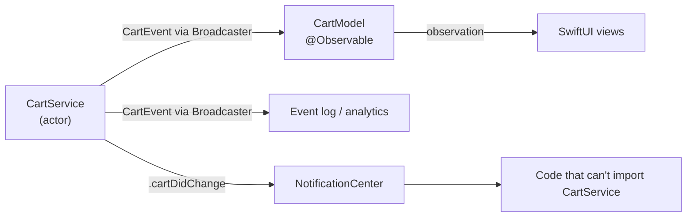

# Observer

> Let objects react to changes in another object without the two knowing much about each other.

Swift has several ways to do this. This pattern builds one cart and observes it three ways, so you can see which tool fits where: **`@Observable`**, **`AsyncStream`** and **`NotificationCenter`**.

## The problem

Classic observer code on iOS mixes delegates, closures, KVO and Combine, each with its own memory and threading rules:

```swift
// ❌ Manual observer lists: retain cycles, forgotten removals, and a data race in Swift 6
final class Cart {
    private var observers: [(Int) -> Void] = []
    func addObserver(_ observer: @escaping (Int) -> Void) { observers.append(observer) }
    func add(_ item: String) {
        items.append(item)
        observers.forEach { $0(items.count) }
    }
}
```

- **Who removes observers?** Nothing does, so closures keep screens alive.
- **Which thread?** Observers run on whatever thread changed the cart.
- **One stream, many listeners:** a plain `AsyncStream` delivers each element to only one consumer.

## The solution

Use the right tool for each kind of observer:



| | `@Observable` | `AsyncStream` + `Broadcaster` | `NotificationCenter` |
|---|---|---|---|
| Best for | SwiftUI views | Services, background work | Loose coupling, system events |
| Type safety | Full | Full (`CartEvent`) | `userInfo` dictionary |
| Delivery | Only what the view reads | Every event, in order | Every post |
| Isolation | `@MainActor` model | Any, via `for await` | The posting thread (or a queue) |
| Unsubscribe | Automatic | Cancel the task | Remove the observer |

## Code

**1. `@Observable` for SwiftUI.** See [`CartModel.swift`](Sources/CartModel.swift). Views re-render only when a property they read changes. `CartBadge` reads `count`, so it updates when an item is added, and not when anything else in the model changes.

**2. A broadcaster for many async listeners.** See [`Broadcaster.swift`](Sources/Broadcaster.swift).

```swift
public actor Broadcaster<Element: Sendable> {
    public func subscribe() -> AsyncStream<Element>
    public func send(_ element: Element)
}
```

Each subscriber gets its own stream. When the subscriber's task is cancelled (a view disappears, a `.task` ends), `onTermination` removes it. No observer lists to clean up by hand.

```swift
.task {
    for await event in await service.events.subscribe() {
        eventLog.append(String(describing: event))
    }
}
```

**3. `NotificationCenter` for code you don't control.** See [`Notification.Name+Cart.swift`](Sources/Notification.Name+Cart.swift). Old UIKit screens, other modules or app extensions can react to `.cartDidChange` without importing `CartService`. The payload is read through one typed helper, `CartNotification.count(from:)`, instead of raw `userInfo` lookups.

## Run it

- **Preview:** open [`ObserverPlayground.swift`](Sources/ObserverPlayground.swift). Add items and watch all three observers update: the badge, the event log and the notification counter.
- **Tests:** `swift test --filter ObserverTests`. They cover multiple subscribers, late subscribers, cleanup on cancellation, `@Observable` change tracking and notification payloads. See [`Tests/`](Tests).

## ⚠️ When NOT to use it

- **A single, known receiver.** If exactly one object needs the result, return it or call a closure. An observer setup for one listener is indirection without benefit.
- **`NotificationCenter` inside your own module:**

  ```swift
  // ❌ Stringly-typed, untyped payload, and invisible in the call graph
  NotificationCenter.default.post(name: .init("CartChanged"), object: nil, userInfo: ["c": 3])
  ```

  Inside the app, prefer typed events or an `@Observable` model. Keep notifications for boundaries.
- **Observing to trigger more observing.** Chains of observers updating each other are hard to follow and easy to loop. Keep one source of truth (`CartService`) and let everything else follow it.

## Trade-offs

| 👍 Gains | 👎 Costs |
|---|---|
| Publishers don't know their subscribers | Flow is harder to trace than direct calls |
| Many listeners without extra code | Late subscribers miss earlier events |
| Automatic cleanup with tasks and observation | Three tools to choose from, each with its own rules |
