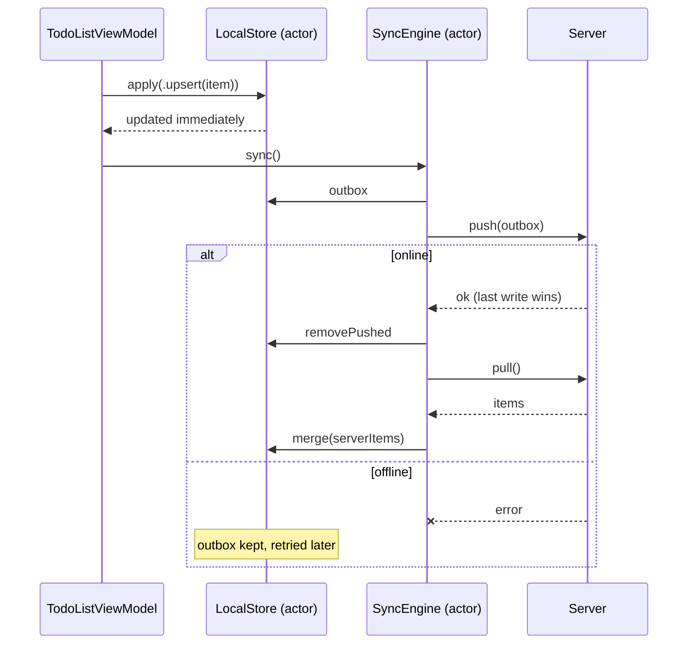

# Offline-first Sync

> The app works without a network. Edits are saved locally right away and synced when the connection comes back.

## The problem

Most apps are network-first: every action waits for the server.

```swift
// ❌ Spinner on every tap, and the edit is lost if the request fails
func toggle(_ item: TodoItem) async {
    isLoading = true
    do {
        try await api.update(item.toggled())
        items = try await api.fetchAll()
    } catch {
        errorMessage = "Something went wrong. Try again."
    }
    isLoading = false
}
```

- **Slow:** every tap waits for a round trip.
- **Fragile:** in an elevator, on a train, on a plane, the app becomes unusable.
- **Lost work:** a failed request throws the user's change away.

## The solution

Make the **local store the source of truth**. User edits are applied locally and appended to an **outbox**. A sync engine pushes the outbox and pulls the server state whenever it can.



## Code

**1. Local store with an outbox.** See [`LocalStore.swift`](Sources/LocalStore.swift). It's an actor, so the UI, the sync engine and background tasks can all use it safely.

```swift
public actor LocalStore {
    public private(set) var items: [UUID: TodoItem] = [:]
    public private(set) var outbox: [Change] = []

    public func apply(_ change: Change) {
        // update items immediately, then queue the change
        outbox.append(change)
    }
}
```

**2. A sync engine that handles actor reentrancy.** See [`SyncEngine.swift`](Sources/SyncEngine.swift).

Actors protect their state, but they are **reentrant**: while `sync()` waits on the network, a second `sync()` can start and push the same outbox again. The engine keeps the running sync in a `Task` and lets later callers join it:

```swift
public func sync() async throws {
    if let inFlight {
        return try await inFlight.value   // join the running sync
    }
    let task = Task { try await performSync() }
    inFlight = task
    defer { inFlight = nil }
    try await task.value
}
```

**3. Conflict resolution: last write wins.** See [`InMemoryTodoServer.swift`](Sources/InMemoryTodoServer.swift). Every item carries `updatedAt`. The server ignores a change that is older than what it has, and deletes leave a tombstone so an old edit can't bring a deleted item back.

**4. Retry with exponential backoff:** `syncWithRetry(attempts: 3, baseDelay: .seconds(1))` waits 1 s, then 2 s.

**5. Sync when the network comes back.** See [`NetworkConnectivityMonitor.swift`](Sources/NetworkConnectivityMonitor.swift). `NWPathMonitor` is wrapped in an `AsyncStream`:

```swift
.task {
    await viewModel.syncWhenOnline(NetworkConnectivityMonitor())
}
```

## Run it

- **Preview:** open [`OfflineSyncPlayground.swift`](Sources/OfflineSyncPlayground.swift). Turn **Online** off, add and tick tasks (the UI reacts instantly and the status bar counts waiting changes), then turn it back on and watch the outbox drain. **Edit from another device** simulates a change made elsewhere.
- **Tests:** `swift test --filter OfflineSyncTests`. They cover offline edits, conflicts in both directions, deletes, retries and concurrent `sync()` calls sharing a single request. See [`Tests/`](Tests).

## Going further

This example keeps things small. A production version usually adds:

- **Persistence:** store `items` and `outbox` in SwiftData, Core Data or SQLite so they survive app restarts.
- **Delta sync:** pull only what changed since the last sync token instead of everything.
- **Background sync:** schedule a `BGAppRefreshTask` to drain the outbox while the app is closed.
- **Smarter merges:** field-level merges or CRDTs when last write wins would lose data.

## ⚠️ When NOT to use it

- **Data that must be correct right now.** Payments, stock levels, seat bookings: the server must confirm before you show success. Showing an optimistic "Booked!" that later fails is worse than a spinner.
- **Read-only or rarely edited data.** A cache is enough (see [Repository](../Repository)). An outbox and conflict rules only pay off when users edit data.
- **Shared data with heavy concurrent editing.** Last write wins silently drops one person's edit. Collaborative documents need operational transforms or CRDTs, not this.
- **Ignoring reentrancy:**

  ```swift
  // ❌ Looks safe because it's an actor, but two calls can overlap at each await
  actor SyncEngine {
      func sync() async throws {
          let pending = await store.outbox
          try await server.push(pending)          // a second sync() can start here…
          await store.removePushed(count: pending.count) // …and remove changes twice
      }
  }
  ```

## Trade-offs

| 👍 Gains | 👎 Costs |
|---|---|
| Instant UI, no spinners for edits | Two copies of the data to keep consistent |
| Works on planes, trains and in elevators | Conflict rules you have to choose and explain |
| No lost edits | The UI can briefly show data the server will reject |
| Fewer, batched network requests | More moving parts: outbox, merge, retry, connectivity |
