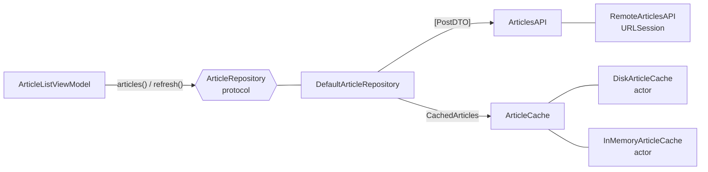
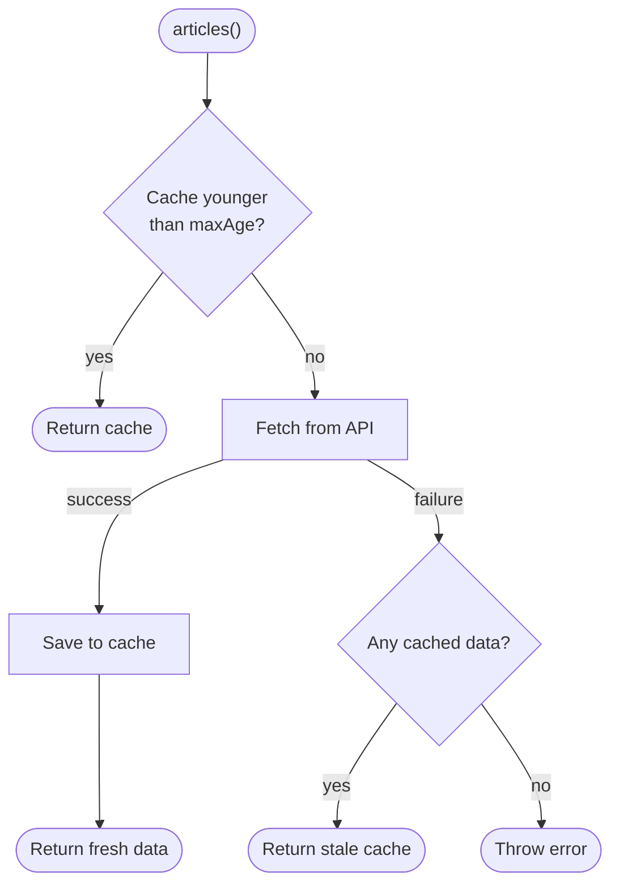

# Repository

> One place that decides where data comes from, so the rest of the app doesn't have to.

## The problem

When a view model talks to the network and the cache directly, data-access rules end up scattered across every screen:

```swift
// ❌ The view model knows about URLs, JSON shapes, cache files and fallback rules
func load() async {
    if let data = try? Data(contentsOf: cacheURL),
       let cached = try? JSONDecoder().decode([PostDTO].self, from: data) {
        posts = cached
    }
    let (data, _) = try await URLSession.shared.data(from: URL(string: "https://api.example.com/posts")!)
    posts = try JSONDecoder().decode([PostDTO].self, from: data)
    try data.write(to: cacheURL)
}
```

- **Duplicated rules:** the next screen that shows articles copies the same cache logic, with slightly different bugs.
- **API shape leaks into the UI:** rename a JSON field and every view model breaks.
- **Hard to test:** you can't check "stale cache + no network" without a real server and a real file.

## The solution

Put a **repository** between the app and its data sources. It speaks the domain language (`Article`) and hides the network, the cache and the rules that combine them.



The caching rule lives in exactly one place:



## Code

**1. Domain model vs API model.** See [`Article.swift`](Sources/Article.swift). The DTO matches the JSON; the domain model matches the UI. Mapping happens inside the data layer.

```swift
extension Article {
    init(dto: PostDTO) {
        self.init(
            id: dto.id,
            title: dto.title.capitalized,
            summary: dto.body.replacingOccurrences(of: "\n", with: " ")
        )
    }
}
```

**2. Data sources behind protocols.** See [`DataSources.swift`](Sources/DataSources.swift). Caches are actors, so concurrent reads and writes are safe without locks.

```swift
public protocol ArticleCache: Sendable {
    func load() async -> CachedArticles?
    func save(_ entry: CachedArticles) async
}

public actor DiskArticleCache: ArticleCache { ... }
```

**3. The repository.** See [`ArticleRepository.swift`](Sources/ArticleRepository.swift).

```swift
public protocol ArticleRepository: Sendable {
    func articles() async throws -> [Article]
    func refresh() async throws -> [Article]
}
```

The clock is injected (`now: @Sendable () -> Date`), so tests can move time forward instead of waiting.

**4. A view model that only sees the domain.** See [`ArticleListViewModel.swift`](Sources/ArticleListViewModel.swift). No URLs, no DTOs, no caches.

## Run it

- **Previews:** open [`ArticleListView.swift`](Sources/ArticleListView.swift). There are four previews: network, offline with a stale cache (still shows data), offline with an empty cache (error) and the live API. Pull to refresh works too.
- **Tests:** `swift test --filter RepositoryTests`. They cover DTO mapping, fresh vs stale cache, offline fallback, the disk cache and pull-to-refresh failures, all without the network. See [`ArticleRepositoryTests.swift`](Tests/ArticleRepositoryTests.swift).

## ⚠️ When NOT to use it

- **Pass-through repositories.** If every method just forwards to the API with no caching, mapping or combining, the repository is an empty layer. Call an API client directly until there is a rule to put in the repository.
- **One generic repository for everything:**

  ```swift
  // ❌ Hides nothing, reveals no intent, and forces CRUD onto read-only data
  protocol Repository<Entity> {
      associatedtype Entity
      func getAll() async throws -> [Entity]
      func get(id: String) async throws -> Entity
      func create(_ entity: Entity) async throws
      func update(_ entity: Entity) async throws
      func delete(id: String) async throws
  }
  ```

  Name methods after what the app needs (`articles()`, `refresh()`, `favorite(_:)`), not after database operations.
- **Leaky repositories.** Returning DTOs, `URLResponse` or `NSManagedObject` defeats the purpose. The repository's API should only mention domain types.
- **UI state in the repository.** Loading flags and selected items belong to the view model. The repository owns data, not screens.

## Trade-offs

| 👍 Gains | 👎 Costs |
|---|---|
| Caching and fallback rules in one place | Extra types: protocol, DTOs, mapping |
| API changes stay inside the data layer | Mapping code for every model |
| Offline behavior testable in milliseconds | Cache invalidation is now your problem |
| View models get simpler | Easy to overbuild for simple read-only screens |
