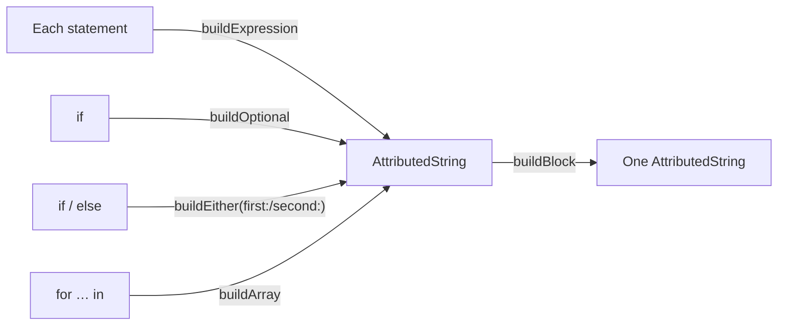

# Result Builder

> Write your own small DSL, the way SwiftUI's `@ViewBuilder` lets you write views.

The example builds **rich text** (`AttributedString`) with plain statements, `if`, `if/else` and `for`.

## The problem

Building styled text by hand is a lot of `append` calls and range bookkeeping:

```swift
// ❌ Hard to read, and the structure of the text is lost in the mechanics
var text = AttributedString("Version \(version)")
text.inlinePresentationIntent = .stronglyEmphasized
if isNew {
    var badge = AttributedString(" NEW")
    badge.inlinePresentationIntent = .code
    text.append(badge)
}
text.append(AttributedString("\n"))
for feature in features {
    text.append(AttributedString("• \(feature)\n"))
}
```

- **The shape of the output is hidden** among temporary variables.
- **Easy to break:** forget one `append` and a line silently disappears.
- **Nesting styles** (bold *and* italic) means merging attributes by hand.

## The solution

A `@resultBuilder` turns a block of statements into one `AttributedString`.

```swift
AttributedString {
    Strong("Version \(version)")
    if isNew {
        " "
        Code("NEW")
    }
    LineBreak()
    for feature in features {
        "• "
        feature
        LineBreak()
    }
    if let breakingChange {
        Strong {
            "Breaking: "
            Emphasis(breakingChange)
        }
    } else {
        Emphasis("No breaking changes.")
    }
}
```

The compiler rewrites that block into calls to the builder's static methods:



## Code

**1. The builder.** See [`AttributedStringBuilder.swift`](Sources/AttributedStringBuilder.swift).

| Method | Enables |
|---|---|
| `buildExpression(_: String)` | Plain string statements |
| `buildExpression(_: some RichText)` | Components like `Strong` and `Hyperlink` |
| `buildBlock(_:...)` | Several statements in a row |
| `buildOptional(_:)` | `if` without `else` |
| `buildEither(first:)` / `buildEither(second:)` | `if/else` and `switch` |
| `buildArray(_:)` | `for` loops |

**2. Components.** See [`Components/`](Sources/Components). `Strong`, `Emphasis` and `Code` can take a string or another builder block, so styles nest. Nested styles are merged, not replaced: `Strong { Emphasis("x") }` is bold **and** italic.

**3. Only Foundation.** Styles use `InlinePresentationIntent` and `link`, which SwiftUI's `Text` renders directly. The DSL itself has no SwiftUI dependency and is tested on macOS without a UI.

## Run it

- **Preview:** open [`ResultBuilderPlayground.swift`](Sources/ResultBuilderPlayground.swift). Toggle the inputs and watch the `if` and `if/else` branches change the output.
- **Tests:** `swift test --filter ResultBuilderTests`. They check text, styles and links for every builder feature. See [`Tests/`](Tests).

## ⚠️ When NOT to use it

- **One-off code.** A builder pays off when the same kind of structure is written many times. For a single string, `append` is fine.
- **Hiding logic in a DSL.** Result builders are for describing structure. Network calls, side effects or complex branching inside a builder block are hard to debug.
- **When errors matter.** Builder blocks give poor compiler errors: a type mismatch deep inside is often reported on the whole block. Keep components small and their types simple.

## Trade-offs

| 👍 Gains | 👎 Costs |
|---|---|
| Code has the same shape as the output | Another concept for the team to learn |
| `if`, `if/else` and `for` just work | Confusing compiler errors inside blocks |
| Components compose and nest | Each new statement kind needs a `buildExpression` |
| No temporary variables or index math | Slower type checking for large blocks |
