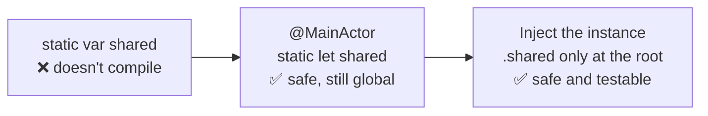

# Singleton ⚠️

> One shared instance for the whole app. Sometimes right, often overused, and Swift 6 makes the classic version a compile error.

This pattern is here mostly as a **cautionary tale**. It shows why the classic singleton breaks, what Swift 6 asks for instead, and how to keep the convenience of `.shared` without its costs.

## The problem

The classic singleton is a global variable with a nicer name:

```swift
// ❌ Swift 6: "static property 'shared' is not concurrency-safe because it is
//    nonisolated global shared mutable state"
final class SettingsStore {
    static var shared = SettingsStore()
    var prefersLargeText = false
}

// ❌ And everything that uses it has a hidden dependency
final class ReaderViewModel {
    var fontSize: Double { SettingsStore.shared.prefersLargeText ? 22 : 17 }
}
```

- **Data races:** any thread can read and write `shared` and its properties.
- **Hidden dependencies:** nothing in `ReaderViewModel`'s initializer says it depends on settings.
- **Tests leak into each other:** one test changes `shared`, the next one sees it.
- **No previews with different values** without mutating global state.

## The fix, step by step



**1. Make it safe.** `static let` instead of `static var`, and an isolation domain for its state. For UI settings, that's the main actor. See [`SettingsStore.swift`](Sources/SettingsStore.swift).

```swift
@MainActor @Observable
public final class SettingsStore {
    public static let shared = SettingsStore(defaults: .standard)

    public init(defaults: UserDefaults) { … }
}
```

**2. Make it replaceable.** The initializer is public and takes its own dependencies, so tests and previews create isolated instances with their own `UserDefaults` suite.

**3. Inject it.** Types receive the store; only the app's root touches `.shared`. See [`ReaderViewModel.swift`](Sources/ReaderViewModel.swift).

```swift
public init(settings: SettingsStore, wordCount: Int)
```

```swift
// App root, the only place that knows about .shared
WindowGroup {
    ContentView().environment(SettingsStore.shared)
}
```

## Picking the right shape

| Shared state is… | Use |
|---|---|
| UI state read by views | `@MainActor @Observable` class, injected via the environment |
| Accessed from background work | An `actor` with `static let shared`, injected where possible |
| Immutable configuration | A `struct` with `static let`, no isolation needed |
| Already thread-safe (a lock inside) | `final class: Sendable` with `let` properties and a `Mutex` / `OSAllocatedUnfairLock` |
| Not actually shared | Not a singleton. Create it where it's needed. |

## Run it

- **Preview:** open [`SingletonPlayground.swift`](Sources/SingletonPlayground.swift). It uses its own `SettingsStore`, not `.shared`, so experimenting never touches your real settings.
- **Tests:** `swift test --filter SingletonTests`. Every test gets its own store, so tests can run in parallel without leaking state. See [`Tests/`](Tests).

## ⚠️ When NOT to use it

- **"I need to reach it from everywhere."** That's a reason to inject it, not to make it global.
- **Silencing the compiler:**

  ```swift
  // ❌ Compiles, and the data race is still there
  nonisolated(unsafe) static var shared = SettingsStore()
  ```

  `nonisolated(unsafe)` is a promise to the compiler that you've made it safe some other way. Only use it when you actually have.
- **Singletons that hold per-user or per-flow state.** A cart, a draft or the current screen's data isn't app-wide. Sign out and sign back in, and the singleton still holds the previous user's data.

## Trade-offs

| 👍 Gains | 👎 Costs |
|---|---|
| One instance, no wiring for app-wide services | Global state, even when isolated |
| `@MainActor`/`actor` make it race-free | Hidden dependency if used directly inside types |
| Fine at the composition root | Tests leak state unless every test injects its own |
