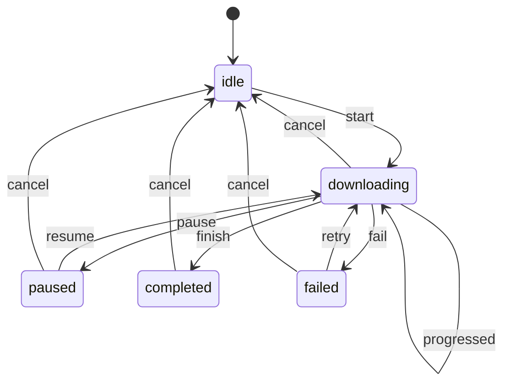

# State Machine

> Model every state a feature can be in as an enum, and every legal move between them in one function.

The example is a **file download** that can start, pause, resume, fail, retry and be cancelled.

## The problem

A screen with several independent flags can end up in states that make no sense:

```swift
// ❌ 5 booleans = 32 combinations, most of them impossible
final class DownloadViewModel {
    var isDownloading = false
    var isPaused = false
    var isFinished = false
    var error: String?
    var progress = 0.0

    func pause() {
        isPaused = true   // …but what if we weren't downloading? or already finished?
    }
}
```

- **Impossible states compile:** `isDownloading && isFinished`, `isPaused && error != nil`.
- **Rules are scattered:** "can I retry now?" is answered differently in each method and each button.
- **Hard to test:** you have to arrange flags just right to reach a case.

## The solution

One enum for the states, one enum for the events, and one pure function for the transitions.



## Code

**1. States carry their own data.** See [`DownloadState.swift`](Sources/DownloadState.swift). Progress only exists where it makes sense, and `completed` has none.

```swift
public enum DownloadState: Sendable, Equatable {
    case idle
    case downloading(progress: Double)
    case paused(progress: Double)
    case completed
    case failed(message: String, progress: Double)
}
```

**2. All transitions in one place.** See [`DownloadState+Transitions.swift`](Sources/DownloadState+Transitions.swift).

```swift
public func next(on event: DownloadEvent) -> DownloadState? {
    switch (self, event) {
    case (.idle, .start): .downloading(progress: 0)
    case (.downloading(let progress), .pause): .paused(progress: progress)
    case (.paused(let progress), .resume): .downloading(progress: progress)
    case (.failed(_, let progress), .retry): .downloading(progress: progress)
    // …
    default: nil
    }
}
```

It's a pure function: no timers, no network, no `self` mutation. `nil` means "not allowed here", and the UI can ask `state.accepts(.pause)` to enable or disable buttons.

**3. Side effects stay outside the machine.** See [`DownloadViewModel.swift`](Sources/DownloadViewModel.swift). The machine decides *whether* an event is allowed. The view model decides *what to do* when it is: start or stop the transfer task.

```swift
@discardableResult
public func send(_ event: DownloadEvent) -> Bool {
    guard let next = state.next(on: event) else { return false }
    state = next
    switch event {
    case .start, .resume, .retry: startTransfer()
    case .pause, .cancel: transfer?.cancel()
    case .progressed, .finish, .fail: break
    }
    return true
}
```

## Run it

- **Preview:** open [`StateMachinePlayground.swift`](Sources/StateMachinePlayground.swift). Buttons are enabled only when the current state accepts their event. The simulated connection drops once at 60%, so you can try **Retry**.
- **Tests:** `swift test --filter StateMachineTests`. Every allowed and rejected transition is a row in a parameterized test, and the view model is tested for completion, failure and retry, pause and ignored events. See [`Tests/`](Tests).

## ⚠️ When NOT to use it

- **Two states.** A `Bool` is a perfectly good state machine for "on/off".
- **Putting side effects in the transition function:**

  ```swift
  // ❌ Now the "pure" function starts network requests and can't be tested as a table
  case (.idle, .start):
      downloader.start(url)
      return .downloading(progress: 0)
  ```

  Keep `next(on:)` pure and run effects after the state changes.
- **Huge flat machines.** Forty states in one enum is hard to read. Split into nested machines (a checkout machine whose `.payment` state has its own machine), or reach for a library.

## Trade-offs

| 👍 Gains | 👎 Costs |
|---|---|
| Impossible states don't compile | Every new state touches the transition table |
| One place answers "can this happen now?" | More ceremony than a couple of flags |
| Transitions are tested as a table | Data shared by several states is repeated in each case |
| UI enables buttons from the same rules | |
