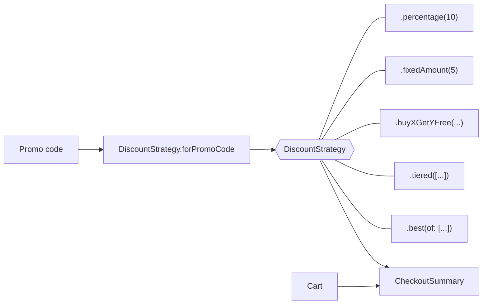

# Strategy

> Pick an algorithm at runtime without the code that uses it knowing which one it got.

The example is **checkout discounts**: percentage off, a fixed amount, "buy 2 get 1 free", spend-more-save-more tiers, all chosen by a promo code.

## The problem

Business rules for pricing tend to grow into one long `switch` inside the checkout:

```swift
// ❌ Every new promotion edits this function, and every branch is tested through checkout
func total(for cart: Cart, promoCode: String?) -> Decimal {
    switch promoCode {
    case "WELCOME10": return cart.subtotal * 0.9
    case "SAVE5": return max(cart.subtotal - 5, 0)
    case "COFFEE3FOR2": ...
    default: return cart.subtotal
    }
}
```

- **Open for modification:** marketing adds a campaign, you edit the checkout.
- **Mixed responsibilities:** checkout knows every promotion's math.
- **Hard to combine:** "give the customer the best of two offers" means another nested `switch`.

## The solution

Put each rule behind one interface. Checkout asks "how much off?" and doesn't care which rule answers.



## Code

**1. A strategy as a value, not a protocol hierarchy.** See [`DiscountStrategy.swift`](Sources/DiscountStrategy.swift).

```swift
public struct DiscountStrategy: Sendable {
    public let name: String
    private let calculate: @Sendable (Cart) -> Decimal

    public func discount(for cart: Cart) -> Decimal {
        min(max(calculate(cart), 0), cart.subtotal).rounded()
    }
}
```

A protocol with one conforming type per rule works too, but for rules that are a single calculation, a struct holding a closure is lighter: no new type per rule, the rules are `Sendable` values, and call sites read like English. Shared guarantees (never negative, never above the subtotal, rounded to cents) live in one place.

**2. A catalog of rules.** See [`DiscountStrategy+Catalog.swift`](Sources/DiscountStrategy+Catalog.swift).

```swift
extension DiscountStrategy {
    public static func percentage(_ percent: Decimal) -> DiscountStrategy
    public static func fixedAmount(_ amount: Decimal) -> DiscountStrategy
    public static func buyXGetYFree(productID: String, buy: Int, free: Int) -> DiscountStrategy
    public static func tiered(_ tiers: [Tier]) -> DiscountStrategy
    public static func best(of strategies: [DiscountStrategy]) -> DiscountStrategy
}
```

`best(of:)` is itself a strategy made from other strategies, so combining rules needs no special code in checkout.

**3. One place maps codes to rules.** See [`DiscountStrategy+PromoCode.swift`](Sources/DiscountStrategy+PromoCode.swift). In a real app this mapping usually comes from the backend or remote config.

**4. Checkout only sees the interface.** See [`CheckoutSummary.swift`](Sources/CheckoutSummary.swift).

```swift
let summary = CheckoutSummary(cart: cart, strategy: .forPromoCode(code) ?? .noDiscount)
```

## Protocol or closure?

| | Struct with a closure (this repo) | Protocol + one type per rule |
|---|---|---|
| New rule | A static function | A new type |
| Call site | `.percentage(10)` | `PercentageDiscount(percent: 10)` |
| Several methods per strategy | Awkward | Natural |
| Stored state per rule | Captured in the closure | Stored properties |
| Best for | Single calculations | Rich behaviors (a `PaymentMethod` with `authorize`, `refund`, `displayName`…) |

## Run it

- **Preview:** open [`StrategyPlayground.swift`](Sources/StrategyPlayground.swift). Type `WELCOME10`, `SAVE5`, `COFFEE3FOR2` or `BULK` and watch the total change.
- **Tests:** `swift test --filter StrategyTests`. They cover every rule, rounding, clamping, tiers, combining and promo code parsing. See [`Tests/`](Tests).

## ⚠️ When NOT to use it

- **Two options that will never be three.** An `if` is clearer than a strategy type and a catalog.
- **Strategies that need to know about each other:**

  ```swift
  // ❌ A "strategy" that checks which other strategy is active isn't interchangeable anymore
  DiscountStrategy(name: "Stacked") { cart in
      if currentPromo == "WELCOME10" { ... }
  }
  ```

  Compose them explicitly instead, like `best(of:)` does.
- **Money math with `Double`.** Unrelated to the pattern but common in examples: use `Decimal` for prices, and never build one from a float literal in tests (`Decimal(2.95)` isn't exact).

## Trade-offs

| 👍 Gains | 👎 Costs |
|---|---|
| New rules without touching checkout | Logic spread across small pieces |
| Each rule tested in isolation | The caller must pick a strategy somewhere |
| Rules combine into new rules | Overkill for a fixed, tiny set of cases |
| Rules can come from config at runtime | |
